---

> **E-Sports 베팅 플랫폼**
> ---

## 📋 목차
🎮 [프로젝트 소개](#-프로젝트-소개)

⭐ [핵심 기능](#-핵심-기능)

⚙️ [프로젝트 설계](#-프로젝트-설계)

📈 [성능 개선](#-성능-개선)

🚨 [트러블 슈팅](#-트러블-슈팅)

🤔 [기술적 의사결정](#-기술적-의사결정)

🛠️ [기술 스택](#-기술-스택)

🧑‍🤝‍🧑 [팀원 소개](#-팀원-소개)

---

## 🎮 프로젝트 소개
**OddVenture — E-Sports 베팅 플랫폼**
> 🌱 개발 배경 및 문제 인식

- e스포츠를 보는 팬들은 단순한 관람보다 **내 선택이 맞았는지 확인하는 순간**에 더 크게 몰입합니다.
- 그러나 지금의 시청 경험은 그 긴장과 기대를 오래 이어갈 장치가 부족합니다. 커뮤니티에서 예측과 토론은 활발하지만, 선택이 기록되거나 보상으로 이어지지 않으니 흥미는 금세 식고, 팬들의 관심은 쌓이지 못한 채 흩어집니다.
- 결과적으로 경기는 흘러가고, 팬들은 **경기에 직접 참여했다는 감각**을 충분히 얻지 못한 채 관람자로만 머물게 됩니다.

> 🎯 솔루션: Oddventure - E-sports 베팅 플랫폼

- Oddventure는 **팬들의 선택과 몰입을 기록하고 보상하는 참여형 플랫폼**입니다.
- Oddventure를 통해 팬들은 단순히 경기를 관람하는 것을 넘어, 자신이 한 선택이 기록되고 결과로 검증되는 경험을 얻습니다.
- 예측이 맞았을 때는 성취감과 보상을 통해 더 큰 재미를 느낄 수 있고, 커뮤니티 안에서 다른 팬들과 함께 토론하며 자신의 위치를 확인하는 즐거움도 누릴 수 있습니다.
- 이렇게 쌓인 참여와 기록은 팬들에게 “**내가 경기의 일부였다**”는 감각을 제공하며, 시청 경험을 단순한 관람에서 참여형 경험으로 확장시킵니다.

> 🤝 핵심 가치 제안

- **가벼운 진입**: 현금이 아닌 게임 포인트로 누구나 부담 없이 참여
- **명확한 보상**: 결과에 따라 배당 포인트를 즉시 정산
- **선택의 기록**: 나의 예측과 결과가 남아 개인적 만족감 강화
- **몰입도 상승**: 베팅을 통한 참여로 경기의 흥미와 몰입 증대

> 🙋 타겟 사용자

- **20-30대 직장인**: 바쁜 일상 속에서 간단하게 재미를 느끼고 싶은 사람
- **E-Sports 팬**: 단순히 보는 것을 넘어 직접 참여하는 재미를 느끼고 싶은 사람
- **관련 사업자/운영자**: 새로운 수익 창출 모델 및 이벤트가 필요한 사람

---

## ⭐ 핵심 기능
<details>
<summary><b>👤 사용자 관리</b></summary>

### 회원가입 및 로그인
- 이메일/비밀번호 기반 일반 회원가입
- JWT 기반 인증 시스템

### 계정 관리
- 이메일 변경 (기존 이메일 확인 후)
- 비밀번호 변경 (기존 비밀번호 확인 후)
- 계정 탈퇴 기능
- Token 갱신 (Refresh Token)

### 프로필 관리
- 개인 프로필 조회 및 수정
- 닉네임, 이메일, 포인트 관리
    
### 권한 관리
- 사용자 권한 설정 (USER, ADMIN)
- 권한별 기능 접근 제어

</details>

<details>
<summary><b>🎯 매치 시스템</b></summary>

### 매치 생성 및 관리
- 스케줄러를 통한 실제 매치 정보 연동
- 트래픽이 적은 새벽시간대를 활용
- 배치를 통한 안정성 확보
- bulk insert 기반 대용량 데이터 삽입
- 매치 정보 수정
    
### 매치 라이프 사이클
- 3단계 상태 관리 (예정 → 진행 → 종료)
- 매치 시작 시 자동 상태값 변화 (진행)
  - 매치 상태 변경 시 실시간 알림 전송(RabbitMQ)
- 실제 매치 결과 연동 및 상태값 변화 (종료)
  - 해당 매치의 배당금 자동 정산

### 배당률 관리
- 팀당 베팅 총액 기반 실시간 배당률 계산
- Redisson 분산 락 기반 동시성 제어

### 매치 통합 검색
- ElasticSearch 기반 검색
- 오타 허용 및 다양한 조건별 검색 (이름, 팀 이름, 기간 등)
- MySQL ↔ Elasticsearch 데이터 동기화
  - RabbitMQ 로 실시간 동기화/ 비동기 처리
  - Redis + Scheduler → RabbitMQ 큐손실 및 부하 방지
  - Spring Batch → 정합성 보장

### 매치 상세 조회
- CQRS 패턴 적용
  - 조회 로직에 Redis 적용
  - Redis INCR로 조회수 증가 로직 구현
</details>

<details>
<summary><b>🎮 베팅 시스템</b></summary>

### 베팅 생성 및 관리
- 베팅 가능 여부 확인 후 생성
  - 포인트 잔액
  - 매치 상태
- 실시간 배당률 적용
- 배당률 변경 시 실시간 알림 전송(RabbitMQ)
- Redisson 분산 락 기반 동시성 제어
    
### 베팅 취소
  - 취소 가능 여부 확인 후 취소
  - 포인트 환불
  - 변경된 사항 실시간 적용
  - Redisson 분산 락 기반 동시성 제어

### 베팅 내역 조회

### 정산 및 배당금 지급
- 매치 종료 후 일괄 지급
- 베팅 생성 시점 배당률 적용
- 스케줄링 및 배치 적용
  - Read/Process/Write 분리를 통한 유지보수 강화
  - 500개의 청크 적용
</details>

<details>
<summary><b>👍 인기검색어 시스템</b></summary>

### Redis ZSet 
- Redis가 메모리 기반 고속 조회 성능 확보
- ZINCRBY 기반 조회수 자동 증가 및 실시간 순위 반영
- 중복 및 데이터 정합성 보장
    
### 캐싱 및 성능 최적화
- 매치 검색 결과 캐싱을 통한 DB 부하 최소화
- 키워드 기반 캐시 무효화 전략 적용

### 스케줄링
- Write-Back기반 DB 연동
- 데이터 원자성 & 정합성 보장
- 인기 검색어 갱신 프로세스 자동화
</details>

<details>
<summary><b>🤖 챗봇 시스템</b></summary>

### 챗봇
- Groq Open API 기반 LLM 연동
- 사용자별 대화 히스토리를 활용한 맥락 유지
- AI-Agent 활용 의사결정 수행
- tool 개발을 통해 모델의 사고 과정 보조
    - ScheduleTool: 일정 정보 제공
    - WinRateTool: 승률 예측 제공
    - HotKeywordTool: 인기검색어 제공
    - Cs2NewsTool: 매치 최신 뉴스 제공
- CoT(Chain of Thought)를 활용한 단계적 추론
- 단계적 사고를 위한 흐름 구현 (ReAct)
- LangGraph를 통한 대화 흐름 관리 및 복잡한 에이전트 로직 구성
    
### 경기 승률 예측
- 데이터 기반 승률 계산 및 예측 제공
- 프롬프트 엔지니어링을 통한 일관성 확보

</details>

<details>
<summary><b>📊 모니터링 & 시각화</b></summary>

### Prometheus
- Spring Acuator 기반 Metric
- k6 기본 제공 Metric
- Custom Metirc
    - TimeOut
    - SlowQuery
    - ErrorRate
    - SearchResponseTime

### Grafana
- Metric 시각화 대시보드 구축
- 장애 모니터링 및 성능 분석에 활용

### Docker 기반 구성
- Prometheus/Grafana를 Docker 컨테이너로 실행하여 손쉬운 배포·운영
</details>

---
## ⚙️ 프로젝트 설계

<details>
<summary><b>🎨 와이어 프레임</b></summary>

</details>


<details>
<summary><b>🗂️ ERD</b></summary>

</details>

<details>
<summary><b>🏗️ Service Architecture</b></summary>

</details>

<details>
<summary><b>🚀 서비스 플로우</b></summary>

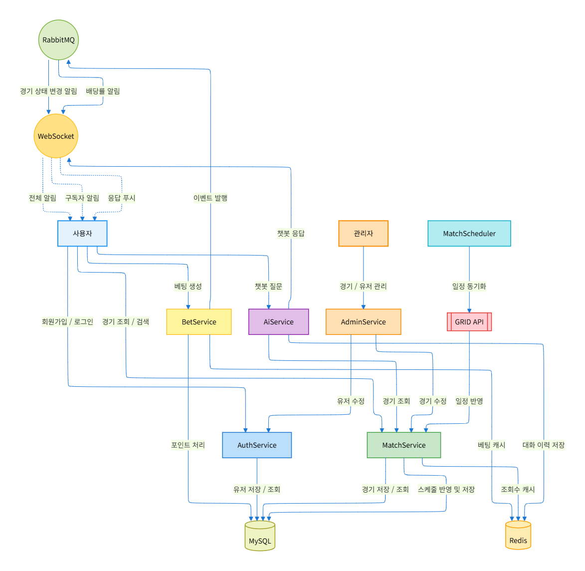
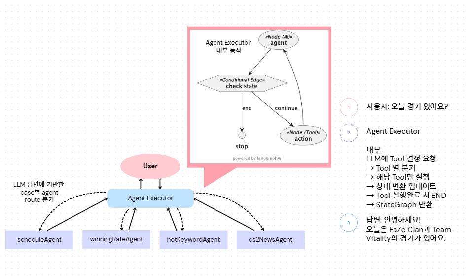
</details>

<details>
<summary><b>📚 API 명세서</b></summary>

📄 **[Oddventure REST API 문서](https://toyou-sparta.github.io/oddventure/)**

</details>

---

## 📈 성능 개선

<details>
<summary><b>[매치] 매치 생성 성능 개선 (Bulk Insert)</b></summary>

## 🎯 한눈에 보는 결과

<aside>

- 데이터 처리 시간 **39.3s → 25.3s**로 **35.5% 단축**
- TPS **254 → 392**로 약 **54% 증가**
- 작은 데이터는 차이 미미하나, 대량에서 기하급수적 효율 증가

</aside>

## 🧪 테스트 환경

<aside>

| 항목 | 설정값 |
| :--- | :--- |
| **테스트 도구** | k6 |
| **테스트 유형** | 데이터 건수별 처리량 (TPS) |
| **대상 API** | `POST /api/v1/admin/matches` |
| **테스트 목적** | 매치 생성 API의 저장 로직 개선 효과 검증 (Batch + Bulk Insert) |

</aside>

## 📊 성능 지표 비교

<aside>

**1) 기존 로직**
* 처리 전략: JPA `saveAll()` 기반 개별 INSERT 반복

| 데이터 건수 | 처리 시간(ms) | 처리량(TPS) |
| :--- | :--- | :--- |
| 100 | 2,926 | 36 |
| 1,000 | 10,726 | 93 |
| 10,000 | 39,387 | 254 |

**2) 배치 + 벌크 인서트**
* 처리 전략: JDBC Batch 기반 Bulk Insert

| 데이터 건수 | 처리 시간(ms) | TPS |
| :--- | :--- | :--- |
| 100 | 2,973 | 35 |
| 1,000 | 8,720 | 114 |
| 10,000 | 25,382 | 392 |

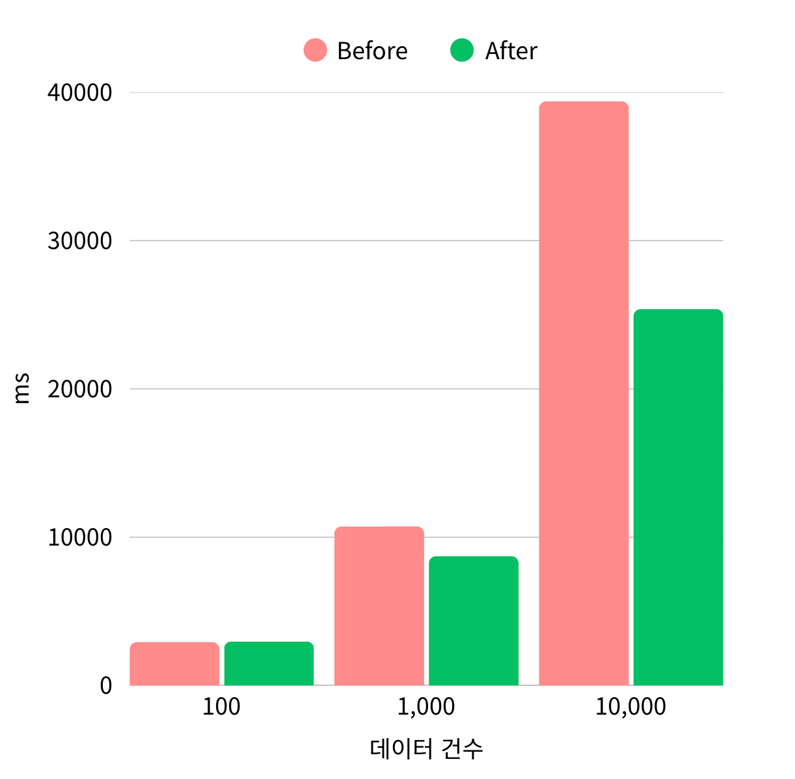

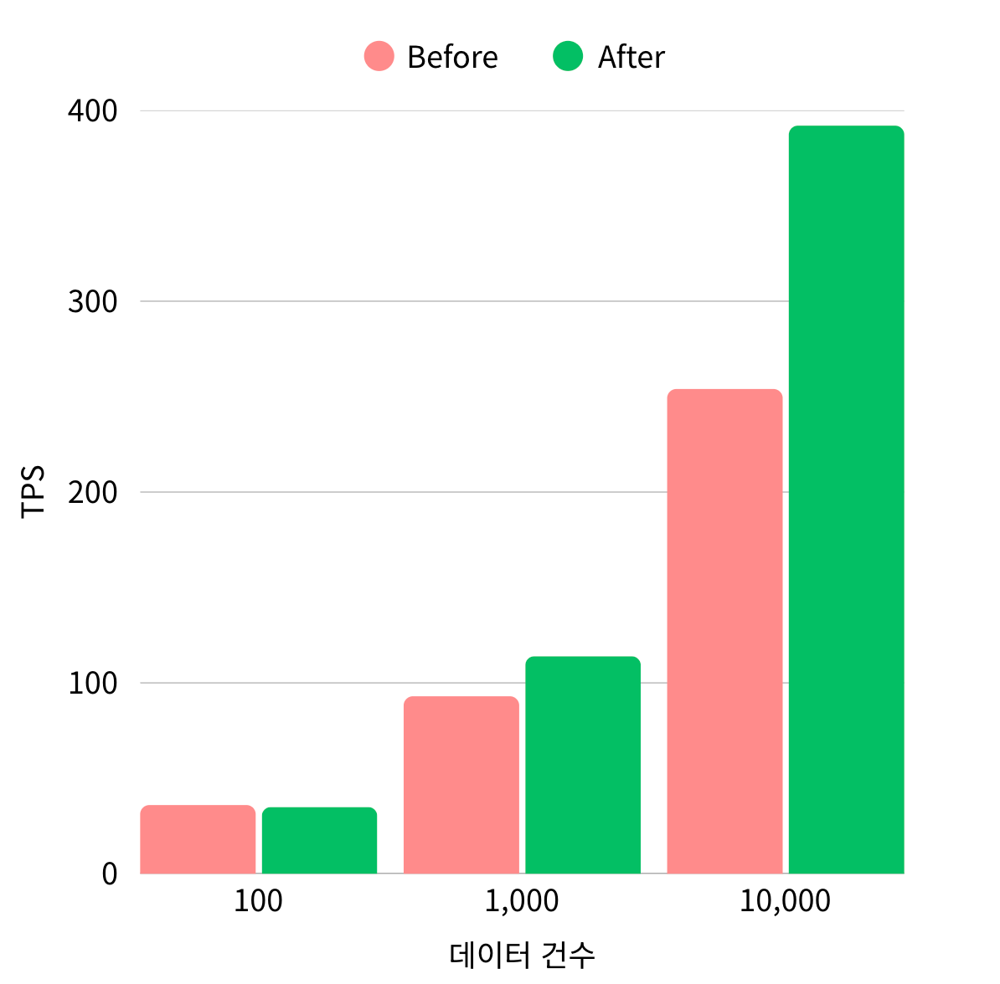

**3) 비교 분석**

**처리 시간(ms) 비교**

| 데이터 건수 | 기존(ms) | 배치(ms) | 변화율(%) |
| :--- | :--- | :--- | :--- |
| 100 | 2,926 | 2,973 | +1.6 |
| 1,000 | 10,726 | 8,720 | -18.7 |
| 10,000 | 39,387 | 25,382 | **-35.5** |

**처리량(TPS) 비교**

| 데이터 건수 | 기존(TPS) | 배치(TPS) | 변화율(%) |
| :--- | :--- | :--- | :--- |
| 100 | 36 | 35 | -2.7 |
| 1,000 | 93 | 114 | +22.6 |
| 10,000 | 254 | 392 | **+54.3** |

</aside>

## 📌 정리

<aside>

**중·대용량 데이터 구간에서 Batch Insert가 명확한 성능 우위**

* **JPA saveAll의 한계**
    * 영속성 컨텍스트 관리 오버헤드
    * 네트워크 왕복 증가
    * 메모리 사용량 상승
* **대량 배치작업 최적화 → JDBC Batch Insert**
    * 네트워크 왕복 감소
    * 선형 성능 구조

> "JDBC Batch Insert 도입으로 대량 데이터(10,000건 기준) 처리 시간이 기존 대비 35% 이상 단축되고, TPS는 54% 이상 증가하여 대량 배치 처리 성능이 크게 향상되었다. 특히 데이터가 증가할수록 JPA saveAll 대비 성능 격차가 확대되는 구조를 보여, 정기 배치 및 대량 적재 환경에서 Batch Insert 전략이 더 적합함"

</aside>

</details>

<details>
<summary><b>[매치] 매치 상태값 업데이트 성능 개선 (DelayQueue)</b></summary>

## 🎯 한눈에 보는 결과

<aside>

- Scheduler 대비 DelayQueue 오차 **99% 감소**
- DelayQueue 기반 매치 단위 분산 처리

</aside>

## 🧪 테스트 환경

<aside>

| 항목 | 설정값 |
| :--- | :--- |
| **테스트 대상** | 매치 상태값 자동 업데이트 |
| **비교 방식** | Scheduler vs RabbitMQ DelayQueue |
| **샘플 수** | 1000건 |
| **테스트 목적** | 정확성, 실시간성, DB 부하 감소를 위한 성능 개선 |

</aside>

## 📊 성능 지표 비교

<aside>

**1) 상태 업데이트 정확도 / 처리 방식**

| 방식 | 처리 구조 | 지연 시간(latency) |
| :--- | :--- | :--- |
| **Scheduler** | 1분 단위 전체 스캔 후 일괄 UPDATE | ~ 6000ms |
| **DelayQueue** | 예약된 시간에 개별 이벤트 소비 | **~ 40ms** |

**2) DB UPDATE 성능**

| 방식 | DB UPDATE 시간 | DB 부하 구조 |
| :--- | :--- | :--- |
| **Scheduler** | 2~4ms | 한 번에 처리 → **순간 부하 집중** |
| **DelayQueue** | 1~2ms | 매치 단위로 분산 처리 → **부하 스파이크 제거** |

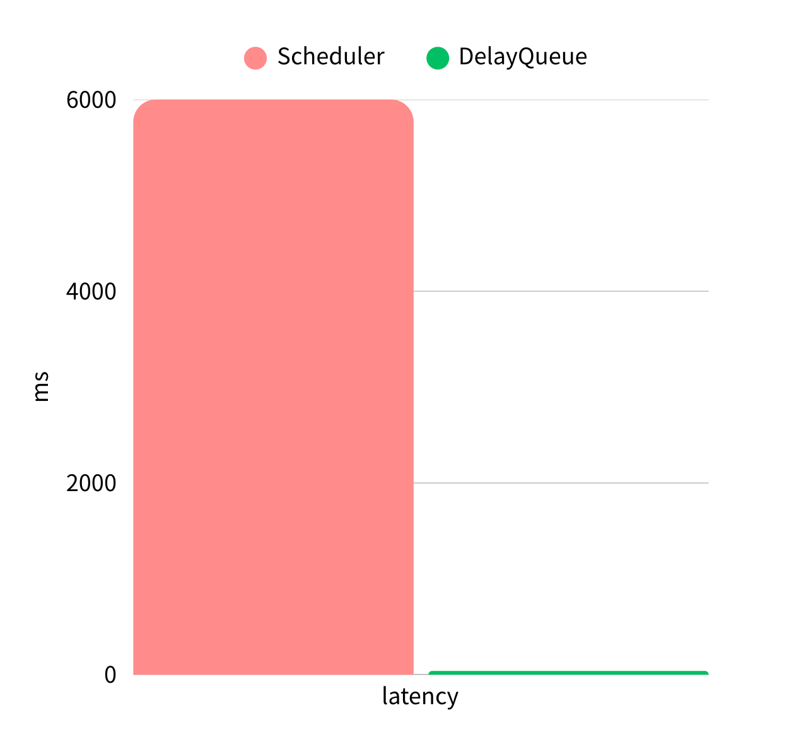

</aside>

## 📌 정리

<aside>

**정확성**

* **Scheduler 기반:** 1분 단위 스캔으로 매치 시작 시각과 실제 상태 변경 시각 사이에 최대 **6000ms 오차**가 발생
* **DelayQueue 기반:** TTL 만료 시 즉시 이벤트를 발행하므로 최대 **40ms 오차** 발생

**DB 부하 구조 차이**

* **Scheduler:** 한 시점에 100건 일괄 UPDATE → **부하 집중**
* **DelayQueue:** 매치마다 DB 1번 UPDATE → 부하가 100등분되어 들어옴 → **고부하 환경에서도 안정적**

- 전체적인 시스템 아키텍처 측면에서도 DelayQueue 방식이 확장성 우위. Scheduler는 전체 스캔 방식이라 데이터가 많아질수록 부하 증가, 반면 DelayQueue는 매치 수 증가해도 자연스럽게 분산 소비.

</aside>

</details>

<details>
<summary><b>[매치] 경기 검색 성능 개선 (Elasticsearch)</b></summary>

## 🎯 한눈에 보는 결과

<aside>

- Elasticsearch 적용 후, 동일 부하에서 4배 많은 요청을 약 60배 빠르게 처리
- 평균 TPS 약 **4배 증가** (15.4 → 62.3 req/s), P95 응답 시간 약 **30배 단축**
- 느린 쿼리 비율 **91.6% → 0.03%** 로 대폭 개선 → 검색 성능 혁신적 향상

</aside>

## 🧪 테스트 환경

<aside>

| 항목 | 설정값 |
| :--- | :--- |
| **테스트 도구** | k6 |
| **테스트 유형** | 동시 사용자 부하 테스트 |
| **대상 API** | 경기 검색 API |
| **최대 VU** | 100명 |
| **테스트 시간** | 4.5 분 |
| **테스트 목적** | MySQL LIKE vs Elasticsearch 검색 성능 비교 |

</aside>

## 📊 성능 지표 비교

<aside>

| 지표 | MySQL LIKE | Elasticsearch | 변화 |
| :--- | :--- | :--- | :--- |
| **평균 TPS** | 15.4 req/s | **62.3 req/s** | **4.0배 ↑** |
| **총 요청 수** | 4,177건 | **17,008건** | **4.1배 ↑** |
| **에러율** | 19.4% | **0%** | **완전 해소** |
| **평균 응답시간** | 4,169 ms | **70.9 ms** | **58.8배 ↓** |
| **P95 응답시간** | 7,523 ms | **245 ms** | **30.7배 ↓** |
| **P90 응답시간** | 5,829 ms | **131 ms** | **44.4배 ↓** |
| **최대 응답시간** | 17,222 ms | **3,000 ms** | **5.7배 ↓** |
| **느린 쿼리 비율** | 91.6% | **0.03%** | **99.9% 감소** |

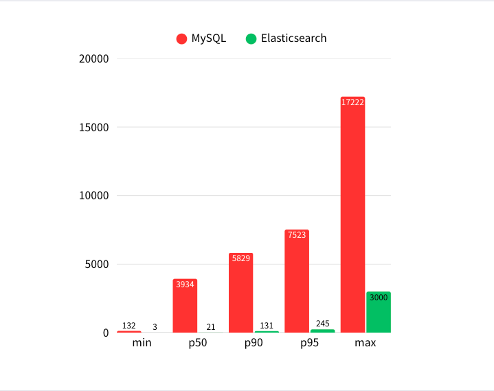

</aside>

## 📌 정리

<aside>

**처리량 & 응답 속도**

* 동일한 부하(동시 100 VU, 약 4.5분 테스트)에서 Elasticsearch는 MySQL LIKE 대비 평균 TPS가 **4배 증가** (15.4 → 62.3 req/s)하여 동일 시간에 4배 많은 요청을 처리
* P95 응답시간은 7,523ms → **245ms**로 **30배 단축**되어, 사용자 체감 성능 극적으로 개선

**안정성 & 신뢰성**

* MySQL LIKE는 19.4%의 에러율과 91.6%의 느린 쿼리 비율을 기록했으나, Elasticsearch는 **에러율 0%, 느린 쿼리 0.03%**로 안정적인 검색 서비스를 제공
* 느린 쿼리(2초 초과)가 3,824건 → **5건**으로 감소하여, 검색 품질이 혁신적으로 향상

> "Elasticsearch 도입으로 검색 성능과 안정성이 획기적으로 개선되어, 대규모 트래픽에서도 빠르고 안정적인 검색 서비스를 제공할 수 있게 됨."

</aside>

</details>

<details>
<summary><b>[매치] 매치 상세 조회 성능 개선</b></summary>

## 🎯 한눈에 보는 결과

<aside>

- 캐싱과 Redis INCR을 통해 DB 쿼리를 0으로 최소화, DB 커넥션 풀 고갈 완전 해결
- P95 응답시간 30초 이상(Time-out) → 15ms로 극적 단축, 응답 속도 2000배 이상 개선
- VUser 500명 부하에서 TPS 109 → 2,450로 약 22배 향상, 시스템 처리량 대폭 증가
</aside>

## 🧪 테스트 환경

<aside>

|**항목**   |**설정값**   |
|---|---|
|**테스트 도구**   |k6   |
|**테스트 유형**   |고정 부하   |
|**대상 API**   |`GET /api/v1/matches/{id}`   |
|**최대 VU**   |500명   |
|**테스트 목적**   |DB 병목 → 캐싱 → Redis INCR 적용을 통한 단계적 성능 개선 검증   |


</aside>

## 📊 성능 지표 비교

<aside>

**1) 요청 처리 / 응답 시간**

| **버전**  |**적용 내용**   |**DB 쿼리 (요청당)**   | **P95 응답시간**  | **TPS** |
|---|---|---|---|-----|
|V1   |기존 코드 (SELECT+UPDATE)   |1 UPDATE, 1 SELECT   |30,017ms (Time-out)   | 109 |
|V2   |로직 분리 (CQRS)   |1 UPDATE, 1 SELECT   |30,772ms (Time-out)   | 12  |
|V3   |캐싱 적용 (@Cacheable)   | 1 UPDATE, 0 SELECT  |30,824ms (Time-out)   | 9   |
|V4   |Redis INCR 적용   |0 UPDATE, 0 SELECT   |15ms   |2,450     |

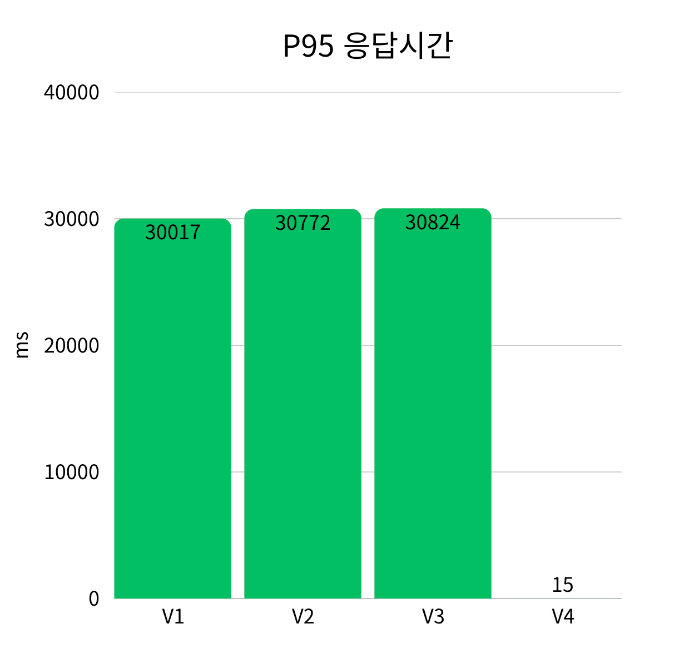

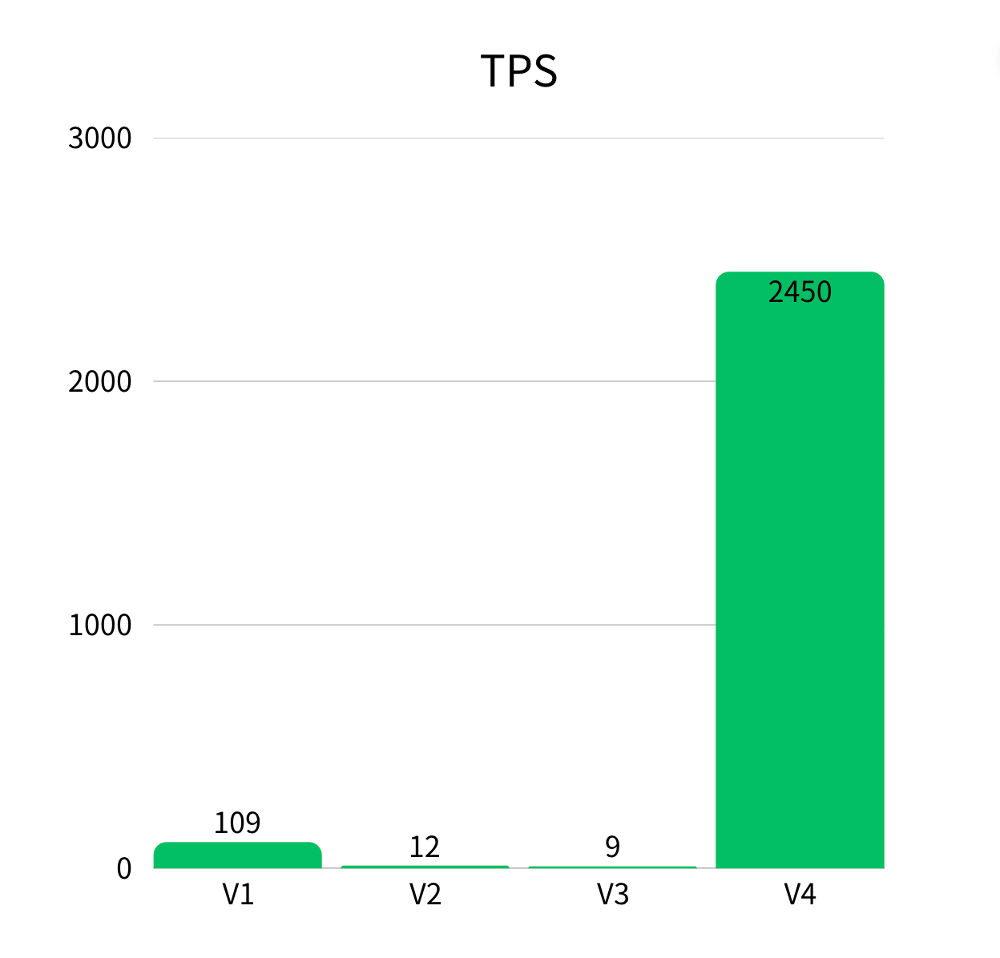

</aside>

## 📌 정리

<aside>

**단계적 병목 분석 및 해결**

* **1차 병목 (V1-V2):** 조회 로직과 조회수 증가가 하나의 트랜잭션으로 묶여 모든 요청이 DB에 `SELECT`와 `UPDATE` 쿼리를 실행. 로직을 분리(CQRS)해도 여전히 DB 커넥션 풀이 고갈되어 모든 요청이 `i/o timeout`으로 실패. 이는 **DB 커넥션 자체가 병목**임을 의미.
* **2차 병목 (V3):** 조회 로직을 캐싱으로 대체하여 `SELECT` 쿼리는 제거했으나, 500명의 사용자가 동시에 `UPDATE`를 호출하면서 5개의 match Row에 **Row Lock 경합**이 발생. 결과적으로 DB 커넥션 풀이 다시 고갈되어 여전히 `i/o timeout`이 발생.
* **3차 해결 (V4):** 조회수 증가 로직을 DB `UPDATE`에서 **Redis `INCR` (원자적 증가)**로 변경하여 DB 접근을 완전히 제거. 이로써 모든 병목이 해결됨.

**극적인 성능 개선**

* V1 대비 P95 응답시간이 30초 이상에서 **15ms**로 약 **2000배 이상 단축**되었고, TPS는 109에서 **2,450**로 약 **22배 향상**.
* VUser 500명 부하 환경에서 에러율 100%가 **0%**로 개선되어 시스템이 완전히 안정화.
* 매치 조회는 이제 DB 의존성 없이 순수 인메모리 저장소(Redis)만으로 빠르고 안정적인 응답을 제공할 수 있게 됨.

> "매치 상세 조회 API는 캐싱과 Redis INCR을 조합하여 DB 접근을 완전히 제거함으로써, 500명 이상의 동시 사용자 환경에서도 약 15ms의 빠른 응답과 높은 처리량(2,450 TPS)을 안정적으로 제공하는 고성능 API가 되었다."

</aside>

</details>

<details>
<summary><b>[베팅] 동시성 제어 (Redisson 분산 락)</b></summary>

## 🎯 한눈에 보는 결과

<aside>

- **분산 락 적용**으로 서버 10대 이상 확장 환경에서도 데이터 정합성 **100% 보장**
- 비관적 락의 HTTP 500 에러율 **100% → 0%**로 개선, 시스템 안정성 극대화
- 락 경합 시 즉시 **409 Conflict** 반환으로 사용자에게 명확한 피드백 제공

</aside>

## 🧪 테스트 환경

<aside>

| 항목 | 설정값 |
| :--- | :--- |
| **테스트 도구** | JUnit 5 (BetServiceConcurrencyTest) |
| **테스트 유형** | 동시성 통합 테스트 |
| **대상 API** | `POST /api/v1/bets` / `POST /api/v1/admin/users/{userId}/points` (베팅 및 포인트 지급) |
| **동시 요청** | 100개 |
| **테스트 목적** | Platform Thread vs Virtual Thread의 처리량, 지연 시간, 스레드 사용량 비교 |

</aside>

## 📊 성능 지표 비교

<aside>

| 지표 | 비관적 락 적용 | 분산 락 적용 | 변화 |
| :--- | :--- | :--- | :--- |
| **데이터 정합성 보장** | 단일 서버만 가능 | **분산 환경 완벽 보장** | **확장성 확보** |
| **HTTP 500 에러율** | 100% | **0%** | **100% ↓** |
| **락 경합 시 응답** | 무한 대기 (시스템 장애 인식) | **409 Conflict 즉시 반환** | **UX 개선** |
| **DB 커넥션 풀 점유** | 점유 (부하 시 고갈) | **미점유** | **자원 효율 향상** |
| **동시 요청 처리 결과** | 정합성 보장 안 됨 | **정확히 10회만 차감, 정합성 100% 보장** | **안정성 확보** |

</aside>

## 📌 정리

<aside>

**분산 환경 데이터 정합성 보장**

- 기존 비관적 락(`SELECT FOR UPDATE`)은 단일 서버에서만 정합성을 보장했지만, 서버가 2대 이상으로 분산되면 각 서버의 DB 커넥션이 독립적으로 작동하여 정합성이 깨질 수 있었음. 분산 락(Redis 기반)을 도입함으로써 중앙 저장소를 통해 락을 제어하여, 서버 10대 이상으로 확장되더라도 데이터 정합성을 100% 보장할 수 있게 됨. `BetServiceConcurrencyTest`에서 20개의 동시 요청이 발생해도 포인트가 0 미만으로 내려가지 않고 정확히 10회만 차감됨을 검증.

**시스템 안정성 및 사용자 경험 개선**

- 비관적 락 사용 시 DB 커넥션 풀 점유로 인한 `i/o timeout` 발생과 HTTP 500 에러(100%)가 완전히 제거됨. 더불어 락 획득에 실패한 요청은 무한정 대기하는 대신 `409 Conflict` (`BET_LOCK_FAILED`)를 즉시 반환하도록 설계하여, 사용자가 시스템 장애가 아닌 일시적 경합 상황으로 인식하고 자연스럽게 재시도할 수 있게 됨.

> "포인트 트랜잭션은 이제 분산 락을 통해 서버가 몇 대로 확장되든 완벽한 데이터 정합성을 보장하며, 시스템 안정성과 사용자 경험을 모두 확보하는 견고한 구조가 되었다."

</aside>

</details>

<details>
<summary><b>[팀] 팀 상세 정보 조회 성능 개선</b></summary>

## 🎯 한눈에 보는 결과

<aside>

- 캐싱 적용 후, 데이터베이스 SELECT 쿼리를 **99.86% 감소**
- 평균 응답시간 약 **52.2% 단축**, P95 응답시간 약 **50% 개선**
- 캐시 히트율 **99.86% 달성** → 데이터베이스 커넥션 풀 부하 대폭 완화

</aside>

## 🧪 테스트 환경

<aside>

| 항목 | 설정값 |
| :--- | :--- |
| **테스트 도구** | k6 |
| **테스트 유형** | 고정 부하 |
| **대상 API** | `GET /api/v1/teams/{id}` |
| **최대 VU** | 100명 |
| **테스트 목적** | 캐싱 적용 전후 응답시간, DB 부하, 캐시 히트율 비교 |

</aside>

## 📊 성능 지표 비교

<aside>

**1) 요청 처리 / 응답 시간**

| 지표 | 적용 전 (캐싱 미적용) | 적용 후 (캐싱 적용) | 변화 |
| :--- | :--- | :--- | :--- |
| **평균 응답시간** | 8.41ms | **4.02ms** | **약 52.2% ↓** |
| **P95 응답시간** | 24ms | **12ms** | **약 50% ↓** |
| **DB SELECT 쿼리** | 11,677회 | **16회** | **약 99.86% ↓** |
| **캐시 히트율** | 0% | **99.86%** | **0% → 99.86%** |
| **총 요청 수** | 11,677건 | 11,782건 | 약 0.9% ↑ |
| **에러율** | 0% | 0% | 안정적 유지 |

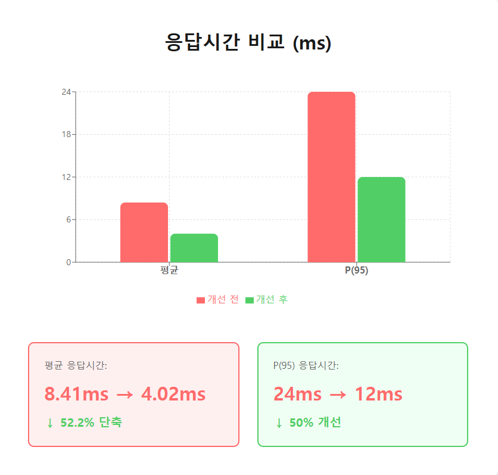

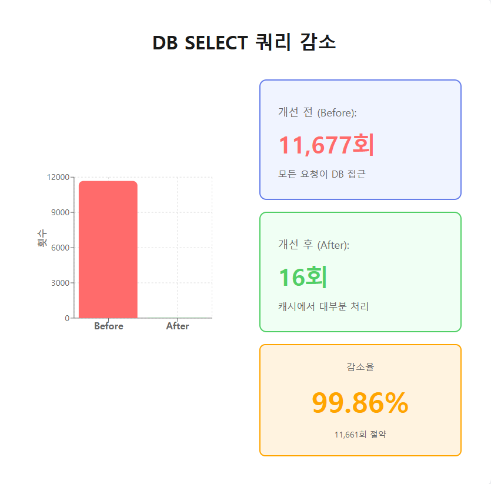
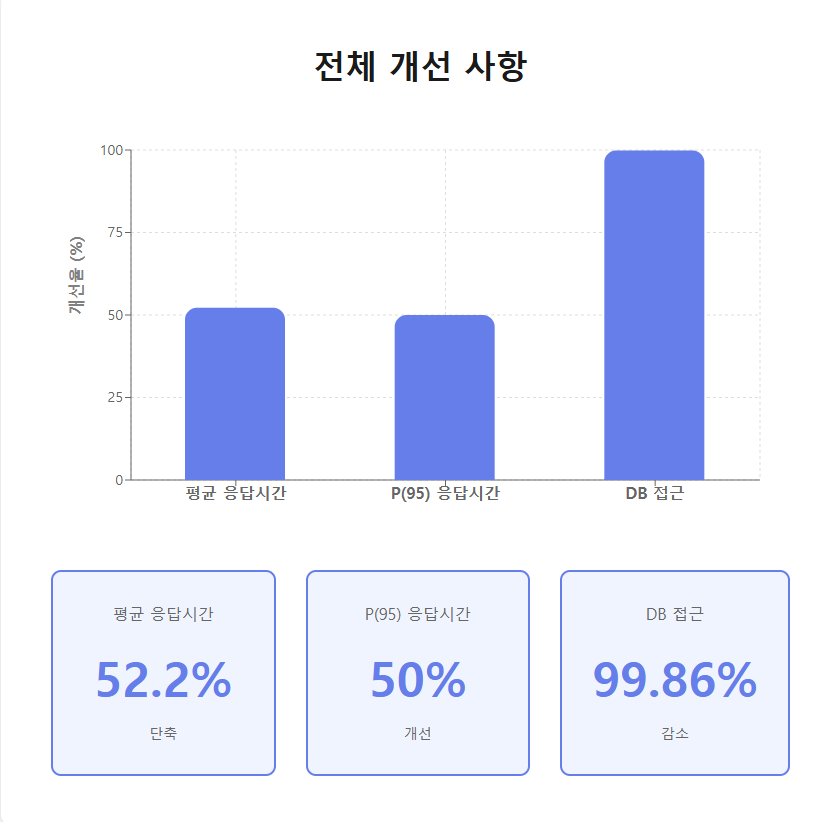


</aside>

## 📌 정리

<aside>

**응답 속도 & 사용자 경험**

- 캐싱 적용으로 평균 응답시간이 8.41ms에서 **4.02ms**로 약 **52.2% 단축**되어, 요청당 4ms 이상 빨라짐. 특히 P95 응답시간이 24ms에서 **12ms**로 약 **50% 개선**되어, 대부분의 사용자가 2배 이상 빠른 응답을 체감할 수 있게 됨.

**데이터베이스 부하 완화 & 확장성**

- DB SELECT 쿼리가 11,677회에서 **16회**로 급감(**99.86% 감소**)하여, 11,782건의 요청 중 99.86%가 캐시에서 처리됨. 이로 인해 데이터베이스 커넥션 풀 낭비가 제거되었으며, 동시 사용자 증가 시에도 안정적인 성능 유지가 가능해짐.

> "팀 정보 조회 API는 이제 캐싱을 통해 동시 100명 이상의 부하에서도 약 4ms의 빠른 응답을 안정적으로 제공하며, 데이터베이스 커넥션 풀에 충분한 여유를 갖게 되어 전체 시스템의 확장성이 크게 향상되었다."

</aside>

</details>

<details>
<summary><b>[챗봇] Platform Thread vs Virtual Thread</b></summary>

## 🎯 한눈에 보는 결과

<aside>

- **Virtual Thread 적용 후**, 더 적은 스레드로 더 많은 요청을 더 빠르게 처리
- 평균 TPS 약 **5.7% 증가**, P95 응답시간 약 **30% 단축**
- JVM 활성 스레드 수 약 **58% 감소** → 자원 효율 대폭 향상

</aside>

## 🧪 테스트 환경

<aside>

| 항목 | 설정값 |
| :--- | :--- |
| **테스트 도구** | k6 |
| **테스트 유형** | 점진 부하 + 고정 부하 (Ramping Load → 500 VU 유지) |
| **대상 API** | `POST /api/v1/chat/loadtest` |
| **최대 VU** | 500명 |
| **테스트 시간** | 약 5분 30초 |
| **테스트 목적** | Platform Thread vs Virtual Thread의 처리량, 지연 시간, 스레드 사용량 비교 |

</aside>

## 📊 성능 지표 비교

<aside>

**1) 요청 처리 / 응답 시간**

| 지표 | 적용 전 (Platform Thread) | 적용 후 (Virtual Thread) | 변화 |
| :--- | :--- | :--- | :--- |
| **평균 TPS (RPS)** | 268.9 req/s | **284.2 req/s** | **약 5.7% ↑** |
| **총 요청 수** | 88,415건 | **93,498건** | **약 5.8% ↑** |
| **에러율** | 약 0.002% (2건) | **0% (0건)** | **안정적 유지** |
| **평균 응답시간** | 565ms | **509ms** | **약 10% ↓** |
| **P95 응답시간** | 750ms | **522ms** | **약 30% ↓** |

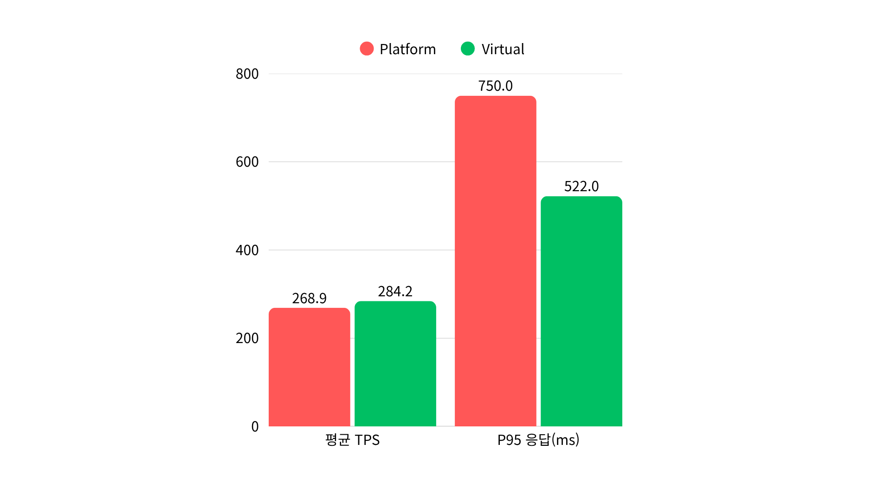


**2) JVM 스레드 사용량**

| 지표 | 적용 전 (Platform Thread) | 적용 후 (Virtual Thread) | 변화 |
| :--- | :--- | :--- | :--- |
| **JVM 활성 스레드 (최대)** | 314개 | **131개** | **약 58% ↓** |
| **JVM 활성 스레드 (평균)** | 250개 | **130개** | **절반 수준 ↓** |

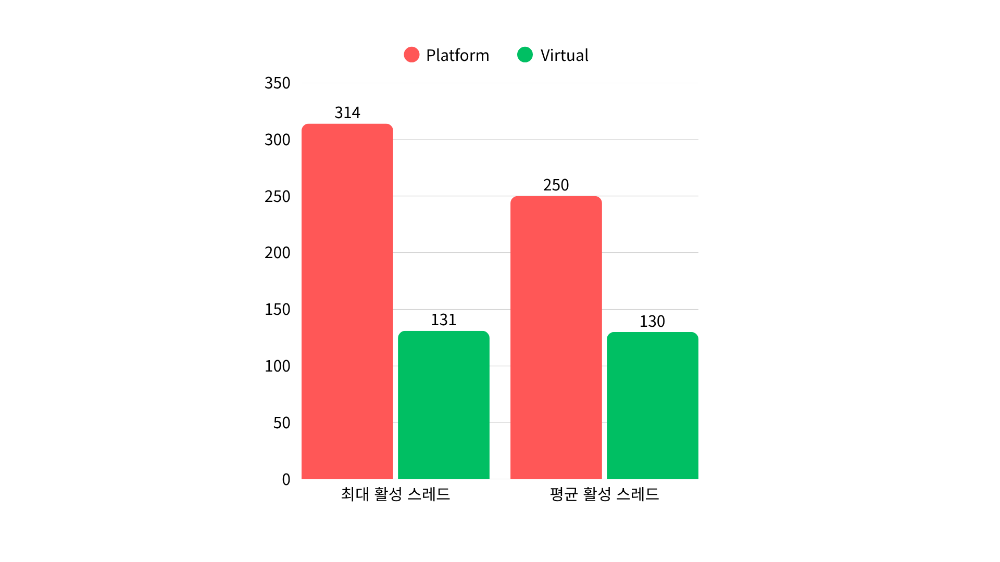

</aside>

## 📌 정리

<aside>

**처리량 & 응답 속도**

동일한 부하(동시 500 VU, 요청당 500ms 블로킹)에서 Virtual Thread 적용 후 평균 TPS는 약 **5.7% 증가**했고, P95 응답시간은 약 **30% 감소** (750ms → 522ms) 하여 느린 구간의 응답 지연이 눈에 띄게 줄어들었다.

**자원 효율 & 확장성**

JVM 활성 스레드 최대 개수가 314개 → **131개** (약 58% 감소)로 줄어, 동일한 트래픽을 훨씬 적은 스레드로 처리할 수 있는 구조가 되었다.

> “동일 인프라에서 동시 500명 챗봇 트래픽을, 더 적은 스레드로 더 빠르고 안정적으로 처리할 수 있는 구조를 검증했다.”

</aside>

</details>

---

## 🚨 트러블 슈팅

<details>
<summary><b>Timezone 불일치 문제</b></summary>

### 🐞 문제 상황 (What Happened)

경기 일정 조회(query_schedule) 기능에서 DB에는 분명히 경기 데이터가 존재함에도 챗봇이 "경기가 없습니다"라고 응답하는 현상이 발생

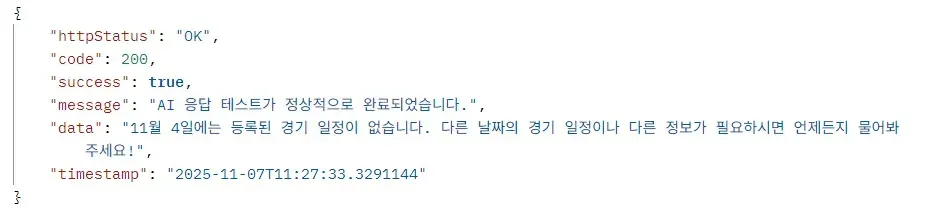

---

### 🔍 원인 분석 (Why)

- DB에 저장된 `start_time` 값은 **UTC 기준**
- 조회 로직에서는 현재 시간을 **KST(`LocalDateTime.now()`) 기준**으로 사용
- 이로 인해 쿼리의 `BETWEEN` 기간이 UTC 데이터와 맞지 않아 조회 누락 발생

**예시**
```
KST 2025-11-04T00:00 → UTC 2025-11-03T15:00
→ 실제 DB의 UTC 데이터와 일자 불일치 발생
```

---

### 🛠 해결 방법 (How Fixed)

조회 범위 계산 시 KST → UTC로 변환하는 전처리 로직을 추가하여 DB 저장 기준(UTC)과 일치하도록 수정

```java
private List<Match> findMatchesByKstRange(LocalDateTime startKst, LocalDateTime endKst) {
    ZoneId UTC = ZoneOffset.UTC;
    LocalDateTime startUtc = startKst.atZone(KST).withZoneSameInstant(UTC).toLocalDateTime();
    LocalDateTime endUtc = endKst.atZone(KST).withZoneSameInstant(UTC).toLocalDateTime();

    return matchRepository.findByStartTimeBetweenOrderByStartTimeAsc(startUtc, endUtc);
}
```

**적용 내용**

- KST 입력값을 UTC로 변환 후 DB 조회
- 시간대 기준 일관성 확보
- 챗봇 응답이 실제 데이터와 일치하도록 수정

### 🌱 결과 및 회고 (Outcome & Learnings)

- KST→UTC 변환 이후 경기 일정이 정상적으로 조회됨
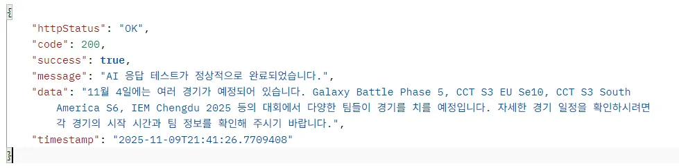

- 시간대 기준을 혼합해서 사용하는 경우, 동일 날짜임에도 실제 DB 범위가 달라지는 문제가 발생할 수 있음을 인지


</details>

<details>
<summary><b>tool_use_failed 오류</b></summary>

### 🐞 문제 상황 (What Happened)

챗봇 개선 과정에서 **모델 툴 호출 실패(`tool_use_failed`) 서버 오류**가 발생

Spring AI에서 예외가 전파되며 클라이언트(Postman)에서는 500 에러로 확인

```java
"code":"tool_use_failed", "failed_generation":"\\u003cfunction=query_schedule{\\"when\\":\\"오늘\\"}..."
```

---

### 🔍 원인 분석 (Why)

**1) 기존 프롬프트 (문제)**

```
[툴 사용 원칙]
- 일정/승률/예측 등 사실 확인이 필요하면 제공된 툴을 사용한다.
- 한 번에 여러 툴이 필요하지 않다면 호출을 최소화한다.

[툴 사용 예시]
사용자: 오늘 경기 있어요?
도구호출: query_schedule({"when":"오늘"})
```

**2) 발생한 근본 원인**

- 프롬프트 내 **few-sho**t 예시 문구가 그대로 답변 본문에 출력됨
- 특히 `도구호출: query_schedule({...})` 같은 문구를 모델이 복사하여 응답 생성
- Groq은 응답 내 `<function=...></function>` 패턴을 실제 함수 호출로 파싱하려 시도
- 하지만 텍스트 그대로라 구조가 맞지 않아 파싱 실패
- 그 결과 **HTTP 400 (tool_use_failed)** → Spring AI에서 500으로 상승

즉, **예시용 텍스트가 의도치 않게 모델 출력으로 섞인 것이 문제의 핵심**이었다.

---

### 🛠 해결 방법 (How Fixed)

**1) 프롬프트 재작성**

툴 사용 원칙은 유지하되, 예시 문구에서 ‘도구호출:’ 같은 자연어 레이블 제거하고, 모델이 그대로 출력해도 문제가 없도록 구조를 단순화했다.

```
[툴 사용 원칙]
- 경기 일정이 필요하면 query_schedule 또는 query_schedule_by_date를 사용한다.
- 팀·리그 승률은 analyze_winning_rate를 사용한다.
- 최근 인기 팀/리그는 query_hot_keywords를 사용한다.
- 한 번에 여러 툴을 사용하지 않는다.

[툴 사용 예시]
사용자: 안녕하세요! → 툴 호출 없이 답변만 생성
사용자: 오늘 경기 있어요? → query_schedule({"when":"오늘"})
사용자: 11월 4일 경기 알려줘 → query_schedule_by_date({"month":11,"day":4})
사용자: Nexus 승률 알려줘 → analyze_winning_rate({"teamA":"Nexus"})
사용자: 요즘 인기팀 뭐야? → query_hot_keywords()
```

**2) 적용한 안정화 조치**

- 툴 호출 예시를 “동작 설명” 형태로 변경해 모델이 텍스트 그대로 출력하지 않도록 정리
- 각 도구 사용 시점을 명확히 지정하여 모델의 선택 혼란 제거
- 프롬프트 전체를 더 간결하고 규칙 기반으로 재구성

### 🌱 결과 및 회고 (Outcome & Learnings)

- 모델이 이제 프롬프트 예시 문구를 출력하지 않음
- Groq이 툴 호출을 정상적으로 파싱
- `tool_use_failed` 및 관련 400/500 오류 모두 해결

#### 이번 사례에서 배운 점

- Few-shot 예시는 최대한 모델이 그대로 출력해도 문제 없는 형태여야 한다.
- “도구호출:” 같은 자연어 레이블은 모델이 그대로 복사할 위험이 있어 사용하면 안 된다.

</details>

<details>
<summary><b>NonUniqueResultException</b></summary>

### 🐞 문제 상황 (What Happened)

- nGrinder로 /api/v1/matches/search API 성능 테스트 실행 시 NonUniqueResultException 발생.

```java
❌ org.springframework.dao.IncorrectResultSizeDataAccessException:
query did not return a unique result: 2 results were returned
```


---

### 🔍 원인 분석 (Why)

#### 2.1 에러 스택 트레이스

```
org.springframework.dao.IncorrectResultSizeDataAccessException:
  query did not return a unique result: 2 results were returned
    at org.springframework.data.jpa.repository.query...
    at org.example.oddventure.domain.hotKeywords.repository.HotKeywordsRepository.findByKeyword()
    at org.example.oddventure.domain.hotKeywords.service.HotKeywordsService.incrementSearchScore()
    at org.example.oddventure.domain.match.service.MatchService.searchMatches()
```


#### 2.2 문제 코드

```java
HotKeywords findByKeyword(String keyword);  // 단일 결과 기대
```

```java
public void incrementSearchScore(String keyword) {
    if (hotKeywordsRepository.findByKeyword(keyword) == null) {  // ← 여기서 에러 발생
        hotKeywordsRepository.save(HotKeywords.of(keyword));
    }
    redisTemplate.opsForZSet().incrementScore(HOT_KEYWORDS_KEY, keyword, 1);
}
```

```java
// MatchService

@Transactional
public Page<MatchResponse> searchMatches(MatchSearchCondition condition, Pageable pageable) {
    Page<MatchProjection> projections = matchRepository.searchByCondition(condition, pageable);

    hotKeywordsService.incrementSearchScore(condition.keyword());  // ← 여기서 호출

    return projections.map(MatchResponse::of);
}
```

#### 2.3 데이터베이스 상태 확인

중복 데이터 존재 확인

```sql
SELECT keyword, COUNT(*) as count
FROM hot_keywords
WHERE is_deleted = 0
GROUP BY keyword
HAVING COUNT(*) > 1;
```

**결과:**

| keyword | count |
|---------|-------|
| Europe | 2 |
| Nexus | 2 |
| Season 50 | 3 |
| SINNERS Esports | 3 |
| CCT S3 Europe Series 9 | 2 |
| bestia | 2 |
| ALGO | 2 |

#### 2.4 발생 메커니즘

<details>
<summary><b>단일 사용자 (정상)</b></summary>

```
[Thread 1]
1. findByKeyword("Europe") → null
2. save(HotKeywords("Europe")) → ID: 1
3. incrementScore("Europe", 1)
✅ 성공
```

</details>

<details>
<summary><b>동시 사용자 (Race Condition)</b></summary>

```
시간  | Thread 1              | Thread 2              | Thread 3
------|----------------------|----------------------|----------------------
T0    | findByKeyword("Europe") |                      |
T1    | → null               | findByKeyword("Europe") |
T2    |                      | → null               | findByKeyword("Europe")
T3    | save("Europe")       |                      | → null
T4    | → ID: 1 ✅           | save("Europe")       |
T5    |                      | → ID: 2 ✅           | save("Europe")
T6    |                      |                      | → ID: 3 ✅
------|----------------------|----------------------|----------------------
결과: keyword="Europe"인 레코드가 3개 생성됨 ❌

[다음 검색 요청]
T7    | findByKeyword("Europe")
T8    | → 3개 레코드 반환
T9    | ❌ NonUniqueResultException 발생!
```

</details>

**결론:**
- 단일 테스트 시 Race Condition 발생 안함
- 높은 동시성: 여러 쓰레드가 동시에 같은 키워드 검색 → Race Condition 발생

---

### 🛠 해결 방법 (How Fixed)

#### 3.1 쿼리 메서드 변경

```java
public interface HotKeywordsRepository extends JpaRepository<HotKeywords, Long> {

    // ❌ 기존 (단일 결과 기대)
    // HotKeywords findByKeyword(String keyword);

    // ✅ 변경 (첫 번째 결과만 반환 + Optional)
    Optional<HotKeywords> findFirstByKeyword(String keyword);

    @Modifying
    @Query("Update HotKeywords hk SET hk.searchCount = :score WHERE hk.keyword = :keyword")
    @Transactional
    void increaseSearchCountByValue(@Param("keyword") String keyword, @Param("score") Double score);
}
```

#### 3.2 Null 체크 변경

```java
public void incrementSearchScore(String keyword) {
    // ❌ 기존
    // if (hotKeywordsRepository.findByKeyword(keyword) == null) {
    //     hotKeywordsRepository.save(HotKeywords.of(keyword));
    // }

    // ✅ 변경
    if (hotKeywordsRepository.findFirstByKeyword(keyword).isEmpty()) {
        hotKeywordsRepository.save(HotKeywords.of(keyword));
    }

    redisTemplate.opsForZSet().incrementScore(HOT_KEYWORDS_KEY, keyword, 1);
}
```

---

### 🌱 결과 및 회고 (Outcome & Learnings)

- `findFirstByKeyword`로 수정 후 `NonUniqueResultException`이 더 이상 발생하지 않음
- **근본 원인 해결책:** `HotKeywords` 엔티티에 `@Table(uniqueConstraints = {@UniqueConstraint(columnNames = "keyword")})` Unique 제약 조건 추가.

```java
@Entity
@Table(name = "hot_keywords", uniqueConstraints = {
    @UniqueConstraint(columnNames = "keyword", name = "uk_hot_keywords_keyword")
})
public class HotKeywords {
    // ...
}
```

</details>

<details>
<summary><b>AWS SSM Client BeanCreationException</b></summary>

### 🐞 문제 상황 (What Happened)

Spring Boot 애플리케이션이 AWS Parameter Store를 사용할 때, 로컬 환경이나 테스트 환경에서 AWS 자격 증명을 찾지 못해 SSM Client Bean 생성에 실패하는 문제가 발생.

```
❌ org.springframework.beans.factory.BeanCreationException:
   Error creating bean with name 'ssmClient'...
   Unable to find AWS credentials
```

---

### 🔍 원인 분석 (Why)

- `spring-cloud-aws-starter-parameter-store` 의존성이 추가되면, Spring Boot는 프로필(`dev`, `test` 등)과 관계없이 **항상** AWS Parameter Store 클라이언트 Bean 생성을 시도.
- `dev` 프로필은 `application-dev.yml`에 따라 AWS Parameter Store에서 환경 변수를 가져와야 하므로 이 동작이 정상이지만, `test` 프로필은 `src/test/resources/application.yml`을 사용하며 실제 AWS 접근이 필요 없음.
- `test` 환경에서는 IAM 역할이나 자격 증명이 없어 AWS SDK가 인증에 실패하며 `BeanCreationException`이 발생하고 앱 실행이 중단됨.


---

### 🛠 해결 방법 (How Fixed)

#### 테스트 환경 설정 (`src/test/resources/application.yml`)

```yaml
spring:
  cloud:
    aws:
      credentials:
        access-key: test-key
        secret-key: test-secret
      region:
        static: ap-northeast-2
```

**설정 내용:**
- `access-key`: 테스트용 더미 자격 증명
- `secret-key`: 테스트용 더미 자격 증명  
- `region`: AWS 리전 설정 (ap-northeast-2는 서울)

### 🌱 결과 및 회고 (Outcome & Learnings)

**결과:**
- 로컬/테스트 환경에서 SSM Client Bean 정상 생성
- AWS Parameter Store 접근 불필요한 환경에서 자격 증명 에러 해결
- 프로덕션 환경에서는 실제 IAM 역할 또는 자격 증명 사용

</details>

<details>
<summary><b>캐싱 적용 후 i/o timeout 지속 발생</b></summary>

### 🐞 문제 상황 (What Happened)

V3 코드는 `getMatch`를 `@Cacheable`로 최적화하고, `incrementViewCount`는 DB로 호출하는 2단계 리팩토링이 적용된 상태였다.

### 문제 설명

캐싱을 적용한 V3 코드에서 예상과 다르게 부하 테스트가 실패함

### 증상
```
K6 부하 테스트 (VUser 500명) 결과:
❌ i/o timeout 오류 (30초)
❌ 느린 응답: 30,824ms
❌ TPS: 12/s (극도로 낮음)

하지만 K6 로그에는 이상한 현상:
✅ cacheHit: true (10~30ms) - 캐싱은 성공하고 있음
❌ DB timeout - 동시에 타임아웃 발생
```
### 예상 vs 실제

예상: SELECT가 Redis로 대체 → DB 부하 감소 → 테스트 성공

실제: 캐싱은 성공했지만, 다른 곳에서 새로운 병목 발생

### 발생 환경

- **테스트 도구**: K6 (VUser 500명, 5개 매치 ID 반복 호출)
- **부하 단계**: warmup(캐싱) → rampUp → load test(최대 부하)
- **데이터베이스**: MySQL 8.0.44

---

### 🔍 원인 분석 (Why)

근본 원인: Row Lock 경합

```
K6 요청 흐름:
VUser 500명 × 5개 매치 ID = 500개 동시 요청
         ↓
     incrementViewCount (DB UPDATE)  ← 병목!
           ↓
500명이 5개의 Row에 UPDATE 쿼리 동시 실행
           ↓
MySQL Row Lock 경합 발생
           ↓
DB 커넥션 고갈 (Timeout)
```

### 기술적 분석

**MatchController 코드 (V3)**:
```
@GetMapping("/{matchId}")
public ResponseEntity<ApiResponse<MatchResponse>> getMatch(@PathVariable Long matchId) {
    // 병목 지점: 500 VUser가 5개 Row에 동시 UPDATE
    matchService.incrementViewCount(matchId);  // ← DB Row Lock 경합
    
    // 캐싱으로 빠르게 응답
    MatchResponse match = matchService.getMatch(matchId);  // ← Redis (10ms)
    
    return ApiResponse.success(match, "매치 상세 조회에 성공했습니다.");
}
```

**병목 발생 메커니즘:**
```
1단계: warmup 후 캐시 생성
   getMatch() → Redis 캐시 저장 (∼100ms)

2단계: load test 시작 (VUser 500명)
incrementViewCount() 호출
						↓
500명 × UPDATE match SET view_count
WHERE id IN (1, 2, 3, 4, 5)
MySQL Row Lock 발생:
• 5개 Row에 동시 Lock 요청
• 500개 요청이 10개 DB 커넥션 점유
• Lock 대기 시간: 30초 이상
• DB 커넥션 풀 고갈
						↓
 i/o timeout 예외 발생
 
3단계: getMatch() 호출
  캐싱은 성공했지만, 
  이전 단계에서 DB 커넥션이 고갈되어 있음 → Timeout
```

**관련 로그 분석**
```
K6 결과 분석:
- cacheHit: true (10~30ms) → getMatch()는 정상
- i/o timeout (30s) → incrementViewCount()에서 발생

원인: Row Lock 경합으로 인한 DB 커넥션 점유
- 500명이 5개 Row Lock을 기다리며 DB 커넥션 30초 이상 점유
- 커넥션 풀(10개) 모두 고갈
- 새로운 요청 불가능 → Timeout
```


---

### 🛠 해결 방법 (How Fixed)

### 핵심 해결책: Redis INCR (원자적 증가)

**의사 결정**:

- 조회수는 100% 실시간 정확도 불필요
- 약간의 손실 허용 가능
- HotKeywordsService에서 이미 검증된 패턴 활용

### Before (V3 - 문제 코드)
```
@Transactional
public void incrementViewCount(Long matchId) {
    matchRepository.incrementViewCount(matchId);  // DB UPDATE → Row Lock 경합
}
```

### After (V4 - 해결 코드)
```
// 1. 조회수 증가 로직 변경 (즉시 반영)
public void incrementViewCount(Long matchId) {
    redisTemplate.opsForValue().increment("match:viewcount:" + matchId);
    // ✅ 1ms 이내 완료, DB 커넥션 사용 안 함
}

// 2. 스케줄러 추가 (5분마다 동기화)
@Scheduled(fixedRate = 300000)  // 5분마다 실행
public void syncViewCountsToDB() {
    Set<String> keys = redisTemplate.keys("match:viewcount:*");
    
    for (String key : keys) {
        Long matchId = Long.parseLong(key.replace("match:viewcount:", ""));
        Long viewCount = (Long) redisTemplate.opsForValue().get(key);
        
        // 배치로 DB에 동기화 (Row Lock 최소화)
        matchRepository.updateViewCount(matchId, viewCount);
        redisTemplate.delete(key);  // 동기화 후 삭제
    }
}
```

### 변경 사항:

|**항목**   |**V3**   |**V4**   |**개선**   |
|---|---|---|---|
|조회수 저장소   |DB (UPDATE)   |Redis (INCR)   |✅   |
|응답 시간   |30,824ms   |15 ms   |2,000배 개선   |
|동기화   |실시간   |5분마다 배치   |✅   |
|정확도   |100%   |15 ms   |허용   |


---

### 🌱 결과 및 회고 (Outcome & Learnings)

### 최종 성능 결과

**V4 테스트 결과** (K6, VUser 500명):

| **지표** | **V1 (원본)** | **V3 (캐싱만)**  | **V4 (최종)**    | **개선율** |
|------|---------|-----------|------------|--------|
| i/o timeout | 발생 | 발생        | 0건         | 100% 개선 |
| 평균 응답 시간 | 30,017 ms | 30,824ms  |  15 ms     | 2,000배 개선 |
|P95 응답시간|30,000ms+| 30,000ms+ |15ms|2,000배 개선|
| TPS | 109/s | 12/s      | 2,450/s  | **22배 향상** |
| 캐시 히트율 | 0%| 99.86%          | 99.86%     | 유지  |

</details>

<details>
<summary><b>No @Tool annotated methods found</b></summary>

### 🐞 문제 상황 (What Happened)

- AI Agent가 사용할 tool을 등록하던 도중 @Tool 어노테이션을 인지하지 못하는 에러가 발생

```java
public AgentService(ChatClient.Builder chatClientBuilder) { 
    this.chatClient = chatClientBuilder 
        .defaultSystem("너는 e스포츠 데이터 기반 AI 챗봇이다. 사용자와의 맥락을 기억한다.") 
        .defaultToolCallbacks(aiService)
        .build(); 
}
```

**에러 메시지:**

```
Caused by: java.lang.IllegalStateException: 
No @Tool annotated methods found in org.example.oddventure.domain.ai.service.AiService@7fad58f8.
Did you mean to pass a ToolCallback or ToolCallbackProvider? 
If so, you have to use .toolCallbacks() instead of .tool()
```

---

### 🔍 원인 분석 (Why)

#### .defaultTools()` vs `.defaultToolCallbacks()

| 항목 | `.defaultTools()` | `.defaultToolCallbacks()` |
|------|------------------|-------------------------|
| `@Tool` 필요? | ✅ 필요 (자동 스캔) | ❌ 필요 없음 (직접 등록) |
| Reflection 으로 메서드 찾음? | ✅ 찾음 | ❌ 찾지 않음 |
| 객체/함수? | 객체를 넣음 → 내부 메서드 스캔 | 함수/콜백을 직접 넣음 |
| 여러 Tool 메서드 지원 | ✅ 가능 | ❌ 1 callback = 1 tool |


- .defaultToolCallbacks()는 tool의 존재를 스캔하려 하지 않으므로, @Tool 어노테이션을 인지하지 못하고 등록에 실패함

---

### 🛠 해결 방법 (How Fixed)

`.defaultToolCallbacks()` → `.defaultTools()` 로 변경

```java
public AgentService(ChatClient.Builder chatClientBuilder) { 
    this.chatClient = chatClientBuilder 
        .defaultSystem("너는 e스포츠 데이터 기반 AI 챗봇이다. 사용자와의 맥락을 기억한다.") 
        .defaultTools(aiService)  // ✅ 변경
        .build(); 
}
```

### 🌱 결과 및 회고 (Outcome & Learnings)

- Spring AI가 `AiService`의 모든 `@Tool` 어노테이션된 메서드를 자동 스캔
- Reflection을 통해 메서드를 찾아 Tool로 등록
- 여러 개의 Tool 메서드를 한 번에 등록 가능

</details>

<details>
<summary><b>API 응답에 @class 필드 노출 및 Redis 역직렬화 실패</b></summary>

### 🐞 문제 상황 (What Happened)

#### 문제 설명

- Spring Boot 애플리케이션에서 Redis 캐싱을 적용한 후 주요 문제 발생:

#### 증상 1: API 응답에 @class 필드 노출

```
{
  "@class": "org.example.oddventure.common.dto.response.MatchResponse",
  "id": 1,
  ...
}
```
**문제**: 클라이언트에게 불필요한 내부 구현 정보 노출

#### 증상 2: Redis 역직렬화 실패
```
ClassCastException: class java.util.LinkedHashMap cannot be cast to 
class org.example.oddventure.domain.match.dto.response.MatchResponse
```

#### 증상 3: 회원가입 / 로그인 API 호출 실패
```
Caused by: com.fasterxml.jackson.databind.exc.InvalidTypeIdException: 
	Could not resolve subtype of [simple type, class org.example.oddventure.domain.auth.dto.request.SignupRequest]: 
		missing type id property '@class'
```
원인: Redis에서 조회한 데이터가 LinkedHashMap으로만 변환됨


---

### 🔍 원인 분석 (Why)

#### 근본 원인

- **ObjectMapper의 역할 충돌**

기존 방식 (단일 ObjectMapper):

|ObjectMapper.DefaultTyping.EVERYTHING   |
|---|
|모든 객체에 @class 추가<br/>① API 응답: @class 포함 (불필요)<br/>② Redis 캐싱: @class 포함 (필수)   |

**기술적 불일치**:

- **API 응답**: `@class` 정보 불필요 (클라이언트에 불필요)
- **Redis 캐싱**: `@class` 정보 필수 (역직렬화 시 타입 정보 필요)

### 데이터 흐름

**Redis 저장 (이전):**
MatchResponse 객체
→ ObjectMapper (with @class)
→ {"@class": "MatchResponse", "id": 1, ...}
→ Redis 저장

**Redis 조회 (문제):**
Redis 데이터 (without @class 또는 @class 정보 불일치)
→ ObjectMapper (needs @class)
→ ❌ LinkedHashMap으로만 변환
→ ❌ ClassCastException 발생

### 관련 로그
```
org.springframework.data.redis.serializer.SerializationException: 
Could not read JSON: Could not resolve subtype of [simple type, 
class java.lang.Object]: missing type id property '@class'
```


---

### 🛠 해결 방법 (How Fixed)
#### 핵심 해결책: ObjectMapper 역할별 분리

#### Before (문제 코드)
```
@Bean
public ObjectMapper redisObjectMapper() {
    ObjectMapper objectMapper = new ObjectMapper();
    // ❌ 모든 용도에 @class 추가
    objectMapper.activateDefaultTyping(
        LaissezFaireSubTypeValidator.instance,
        ObjectMapper.DefaultTyping.EVERYTHING,  // 문제!
        JsonTypeInfo.As.PROPERTY
    );
    return objectMapper;
}
```

#### After (해결 코드)
```
// 응답용 ObjectMapper (HTTP 응답, @class 없음)
@Bean
public ObjectMapper objectMapper() {
    ObjectMapper objectMapper = new ObjectMapper();
    objectMapper.registerModule(new JavaTimeModule());
    objectMapper.disable(SerializationFeature.WRITE_DATES_AS_TIMESTAMPS);
    // 타입 정보 추가 없음
    return objectMapper;
}

// Redis 캐싱용 ObjectMapper (@class 포함)
@Bean("redisObjectMapper")
public ObjectMapper redisObjectMapper() {
    ObjectMapper objectMapper = new ObjectMapper();
    objectMapper.registerModule(new JavaTimeModule());
    objectMapper.disable(SerializationFeature.WRITE_DATES_AS_TIMESTAMPS);
    
    // Redis 캐싱에만 타입 정보 추가
    objectMapper.activateDefaultTyping(
        LaissezFaireSubTypeValidator.instance,
        ObjectMapper.DefaultTyping.NON_FINAL,
        JsonTypeInfo.As.PROPERTY
    );
    return objectMapper;
}

// CacheManager에 Redis용 ObjectMapper 명시적 주입
@Bean
public CacheManager cacheManager(
        RedisConnectionFactory redisConnectionFactory,
        @Qualifier("redisObjectMapper") ObjectMapper redisObjectMapper) {
    
    GenericJackson2JsonRedisSerializer serializer = 
        new GenericJackson2JsonRedisSerializer(redisObjectMapper);
    
    RedisCacheConfiguration config = RedisCacheConfiguration
            .defaultCacheConfig()
            .serializeValuesWith(
                RedisSerializationContext.SerializationPair.fromSerializer(serializer)
            );
    
    return RedisCacheManager.builder(redisConnectionFactory)
            .cacheDefaults(config)
            .build();

```


### 🌱 결과 및 회고 (Outcome & Learnings)
#### 정상 동작 확인

**Postman API 응답 (개선)**:
```
{
  "id": 1,
  "matchName": "T1 vs Gen.G",
  "teamA": "T1",
  "teamB": "Gen.G"
}
```
@class 필드 없음 (깔끔한 응답)

Redis 저장 데이터 (내부용):
```
{
  "@class": "org.example.oddventure.domain.match.dto.response.MatchResponse",
  "matchId": 1,
  "matchName": "T1 vs Gen.G",
  "teamA": "T1",
  "teamB": "Gen.G"
}
```
@class 정보 포함 (정확한 역직렬화)


</details>


<details>
<summary><b>Steam API 응답 불안정으로 인한 매핑 실패 예방</b></summary>

### 🐞 문제 상황 (What Happened)
챗봇에서 CS2 최신 뉴스를 조회하는 과정에서,
**Steam Web API 응답 형식에 따라 매핑 오류가 발생할 수 있는 잠재 문제가 발견**되었다.

현재 운영에서는 정상 동작하고 있지만, Steam API 특성상 언제든 아래와 같은 상황이 발생할 수 있다.

- 정상 JSON 대신 **HTML 오류 페이지** 또는 **에러 JSON** 반환
- `appnews`, `newsitems`와 같은 필드가 **null 또는 누락**
- 응답이 지연되거나 서버가 불안정할 때 **불완전한 JSON** 반환

이 경우 Jackson 역직렬화 단계에서 예외가 발생하며 **Tool 레벨에서 실패 → 챗봇 전체 응답 중단**으로 이어질 수 있었다.

---

### 🔍 원인 분석 (Why)
문제의 근본 원인은 **외부 API 응답을 DTO로 직접 매핑하는 강한 결합 구조**였다.

```java
SteamNewsResponse response = steamClient.get()
        .uri(STEAM_NEWS_PATH, count)
        .retrieve()
        .body(SteamNewsResponse.class);
```

### 분석 내용

- Steam API는 상황에 따라 JSON이 아닌 HTML/에러 JSON을 반환할 수 있음
- JSON 구조가 조금만 달라져도 → `HttpMessageConversionException` 발생
- 정상 JSON이어도 `appnews` 또는 `newsitems`가 null일 경우 → 즉시 NPE
- Tool 기반 챗봇은 Tool 오류가 발생하면 전체 답변이 실패하므로 리스크가 매우 큼

즉, **정상 JSON만 온다는 전제**가 위험의 핵심이었다.

---

### 🛠 해결 방법 (How Fixed)
외부 시스템의 불확실성을 고려해 **방어적 파싱 + Retry(Backoff) + fallback 응답** 구조로 개선했다.

### 1) 방어적 파싱 및 예외 처리 추가

```java
try {
    SteamNewsResponse response = fetchNewsWithRetry(count);

		// null-safe 검증 강화
    if (response == null || response.appnews() == null || response.appnews().newsitems() == null
            || response.appnews().newsitems().isEmpty()) {
        log.warn("Steam API 응답 필드 누락 → fallback 반환");
        return fallbackNews();
    }

    return response.appnews().newsitems();
} catch (Exception e) {
    return fallbackNews();
}
```

### **2) Retry + Backoff 적용 (일시적 외부 장애 대응)**

```java
@Retry(name = "steamNews", fallbackMethod = "fetchNewsFallback")
public SteamNewsResponse fetchNewsWithRetry(int count) {
    return steamClient.get()
            .uri(STEAM_NEWS_PATH, count)
            .retrieve()
            .body(SteamNewsResponse.class);
}

public SteamNewsResponse fetchNewsFallback(int count, Throwable t) {
    log.warn("Retry 실패 → fetchNewsFallback 실행. 원인: {}", t.getMessage());
    return null;
}
```

- 외부 API 일시적 장애 시 자동 재시도
- 최종 실패 시에도 fallback으로 전환

### 3) fallback 응답 제공

```java
private List<Cs2NewsItem> fallbackNews() {
    return List.of(
            new Cs2NewsItem(
                    "CS2 최신 뉴스 정보를 가져올 수 없습니다.",
                    "https://store.steampowered.com/app/730/CounterStrike_2", // Steam 공식 CS2 페이지
                    "잠시 후 다시 시도해주세요.",
                    System.currentTimeMillis()
            )
    );
}
```

- 외부 API 장애 시에도 챗봇 대화 흐름 유지

---
### 🌱 결과 및 회고 (Outcome & Learnings)
- Steam API의 일시적 오류나 지연, 스키마 변경에도 더 이상 챗봇이 중단되지 않음
- JSON 매핑 실패로 인한 서버 오류 위험을 제거
- Tool 호출 실패 감소 → 챗봇 응답 안정성 증가
- 외부 연동은 불확실성이 높으므로, 실패에 대비한 방어적 설계가 필수적임을 다시 한 번 확인했다.

</details>


<details>
<summary><b>LangGraph4j Map<'String, Object'> 에 의한 타입 에러</b></summary>

### 🐞 문제 상황 (What Happened)
ChatbotService의  classifyTool 메서드 실행 중
AgentExecutor에서 case 분기가 제대로 이루어지지 않는 것을 확인하였다.

테스트 코드 실행 시,

- "Unexpected value: " + current 반환됨
- current = [hotKeyword,winRate] 로 인지
- split 리스트화가 제대로 동작하지 않음

이 경우 Tool 분류 데이터가 제대로 전달되지 않음 **→ Tool 분기 실패**

- 문제 발생 코드

    ```java
    //tool 분류 메서드
        public List<String> classifyTools(String userMassage) {
    
            String prompt = """
                    너는 사용자 의도를 정확히 분류하는 분류기입니다.
                    가능한 출력 값(따옴표 없이):
                    - schedule
                    - winRate
                    - hotKeyword
                    - cs2News
                    - default
                    
                    [출력 규칙]
                    1. 목록 중 여러 개에 해당할 경우 반점(,)으로 구분해 출력합니다.
                    2. 추가 설명, 문장, 마침표, 따옴표, 괄호, 공백 등은 절대 포함하지 않습니다.
                    3. 반환값이 없을 경우는 존재하지 않습니다.
                    4. 예: schedule
                    5. 예: schedule,hotKeyword
                    
                    [사용자 질문 예시]
                    사용자: 오늘 경기 일정 알려줘 → schedule
                    사용자: FaZe Clan 팀의 승률 알려줘 → winRate
                    사용자: 요즘 제일 핫한 경기 이름 알려줘 → hotKeyword
                    사용자: Counter-Strike 2 패치노트 알려줘 → cs2News
                    사용자: FaZe Clan 팀의 배당률 알려줘 → default
                    사용자: FaZe Clan 팀의 승률과 배당률 알려줘 → winRate,default
                    """;
    
            CallResponseSpec callTools = chatClient
                    .prompt(prompt)
                    .user(userMassage)
                    .call();
    
            String answer = callTools.content();
            if (answer != null) {
                return Arrays.stream(answer.split(",")).toList();
            }
            throw new NullPointerException();
        }
    ```

    ```java
    public StateGraph<State> build() throws GraphStateException {
                var shouldContinue = (EdgeAction<State>) state -> {
                    log.info("shouldContinue state: {}", state);
                    List<String> intent = new ArrayList<>((List<String>)state.getMid().get("intent"));
                    if (intent.isEmpty()) {
                        return END; // flow 실행 완료 후 END로 연결, 체이닝 종료
                    }
    
                    // intent 내에 툴 중 맨 앞의 agent 추출 후 case 분기 및 실행
                    String current = intent.get(0);
                    return switch (current) {
                        case "schedule" -> "scheduleAgent";
                        case "winRate" -> "winRateAgent";
                        case "hotKeyword" -> "hotKeywordAgent";
                        case "cs2News" -> "cs2NewsAgent";
                        case "default" -> "defaultAgent";
                        default -> throw new IllegalStateException("Unexpected value: " + current);
                    };
                };
    
    ```

---

### 🔍 원인 분석 (Why)
에러 로그를 살펴봤을 때, value 값이 [hotKeyword,winRate] 이었으므로

List<String>이 AgentExecutor로 데이터를 넘기면서 타입 문제가 있었으리라 추측

문제의 근본 원인은 **List<String> 이 StateGraph 형식인 Map<String, Object>로 전환되었기 때문**이었다.

```java
Object answer = chatbotService.classifyTools(query); //classifyTools 메서드는 List<String>을 반환함
        Map<String, Object> mid = new HashMap<>(); 
        mid.put("intent", answer); //그러나 그 데이터가 Object에 들어가면서 타입이 변형됨
```

### **문제 해결을 위해 시도한 것**

1. **Map<> 타입 변경**

→ Map<String, List> 혹은 Map<String, String>으로 변경을 시도

그러나, Tool들의 형태를 고정시키는 것은 멀티 에이전트의 장점(유연함 등)을 반감시킴

실제로도 많은 예제들이 Map<String, Object> 형태를 선호

- Map 구조가 주로 선택되는 이유

```csharp
✔ 유연함

✔ LLM 기반의 동적 데이터 구조에 적합함

✔ 여러 Agent 간 데이터 전달이 간편함

✔ JSON 직렬화도 편함
```

그러므로 이 방식은 채택하지 않게 되었다.

1. **List<String>으로 타입 유지**

```csharp
List<String> intent = new ArrayList<>((List<String>)state.getMid().get("intent"));
//rom
```

→ 강제 형변형을 통한 타입 유지

Object로 변형된 타입을 다시 형변형 시켜주었지만 current = [hotKeyword,winRate]

즉, List 사이즈가 1인 채로 두 개의 툴이 분리되지 않는 것을 볼 수 있었다.

1. **State로 타입 변경**

각 단계가 새로운 state 객체를 반환하게 하는 방식

```csharp
public State callScheduleAgent(State state) {
    var query = (String) state.getInput().get("query");
    var response = agentService.execute(query, List.of());

    Map<String, Object> newOutput = new HashMap<>(state.getOutput());
    newOutput.put("schedule", response);

    return new State(state.getInput(), newOutput);
}
```

- 각 단계가 이전 단계의 State 를 입력으로 받고, 새로운/수정된 State 를 반환
- 함수 호출 순서 자체가 체이닝 연결 역할을 함
- 별도 StateGraph 없이도 전체 흐름을 관리 가능

선택하지 않은 이유는 다음과 같다.

- 복잡한 조건 분기, 여러 에이전트 간 동시 호출, 순환 구조 등이 필요
- 예: `A → B → C`, 동시에 `A → D → E` 같은 흐름을 시각화

LangGraph를 도입한 만큼 단순 체이닝이 구현 목표가 아닌

위와 같은 조건을 위해 해당 방식도 채택하지 않았다.

### 분석 내용

즉, 가공된 List<String> 데이터 타입이 무의미해지고 AgentExecutor의 타입을 변경하는 것은 어렵다.


---

### 🛠 해결 방법 (How Fixed)
분석 내용을 고려해 채택한 방식은

무의미한 List<String>은 String으로 변환

가공되지 않은 채 전달된 String 데이터를 AgentExecutor에서 저장

### 1) 데이터를 List화 하지 않고 String으로 전달

```csharp
//tool 분류 메서드
    public String classifyTools(String userMassage) {

        String prompt = """
                [사용자 요청]
                %s
                """.formatted(userMassage);

        String system = """
                너는 사용자 의도를 정확히 분류하는 분류기입니다.
                가능한 출력 값(따옴표 없이):
                - schedule
                - winRate
                - hotKeyword
                - cs2News
                - default
                
                [출력 규칙]
                1. 목록 중 여러 개에 해당할 경우 반점(,)으로 구분해 출력합니다.
                2. 추가 설명, 문장, 마침표, 따옴표, 괄호, 공백 등은 절대 포함하지 않습니다.
                3. 반환값이 없을 경우는 존재하지 않습니다.
                4. 예: schedule
                5. 예: schedule,hotKeyword
                
                [사용자 질문 예시]
                사용자: 오늘 경기 일정 알려줘 → schedule
                사용자: FaZe Clan 팀의 승률 알려줘 → winRate
                사용자: 요즘 제일 핫한 경기 이름 알려줘 → hotKeyword
                사용자: Counter-Strike 2 패치노트 알려줘 → cs2News
                사용자: FaZe Clan 팀의 배당률 알려줘 → default
                사용자: FaZe Clan 팀의 승률과 배당률 알려줘 → winRate,default
                """;

        CallResponseSpec callTools = chatClient
                .prompt(prompt)
                .system(system)
                .call();

        return callTools.content();
    }
```

```java
public Map<String, Object> callClassifyAgent(State state) {
        log.info("callClassifyAgent: {}", state);

        var query = (String) state.getInput().get("question");
        Object answer = chatbotService.classifyTools(query);
        Map<String, Object> mid = new HashMap<>();
        mid.put("intent", answer);

        log.info("Classify Agent Output: {}", mid);

        return Map.of(State.MID, mid);
    }
```

### **2) 받은 String 데이터 리스트화**

```java
String intent = (String) state.getMid().get("intent");
                if (intent.isBlank()) {
                    return "end"; // flow 실행 완료 후 END로 연결, 체이닝 종료
                }

                List<String> intentList = new ArrayList<>(Arrays.stream(intent.split(",")).toList());
```

- 이 방식이면 split 구분도 잘 됨


### 🌱 결과 및 회고 (Outcome & Learnings)
- Steam API의 일시적 오류나 지연, 스키마 변경에도 더 이상 챗봇이 중단되지 않음
- JSON 매핑 실패로 인한 서버 오류 위험을 제거
- Tool 호출 실패 감소 → 챗봇 응답 안정성 증가
- 외부 연동은 불확실성이 높으므로, 실패에 대비한 방어적 설계가 필수적임을 다시 한 번 확인했다.

</details>


---

## 🤔 기술적 의사결정

<details>
<summary><b>JWT / Spring Security</b></summary>

## 1. 도입 배경

<aside>

- Oddventure는 사용자 인증이 필요한 API가 많고, 일반 사용자·관리자 등 역할 기반 접근 제어가 필요한 구조

- Redis Pub/Sub, WebSocket 등 실시간 구조를 많이 사용하기 때문에 서버가 세션 상태를 저장하는 방식은 확장성과 유지보수 측면에서 불리

- 서버 증설, 수평 확장, 프론트 분리 환경을 감안했을 때, Stateless 인증 방식이 가장 적합하다고 판단

</aside>

## 2. 기술적 요구사항

<aside>

- 서버 상태 저장 없이 수평 확장 가능한 인증 방식일 것

- WebSocket, 실시간 흐름과 자연스럽게 연동 가능할 것

- 역할(Role)에 따라 접근 제어가 명확히 가능한 구조일 것

- 구현과 운영 난이도가 과도하게 높지 않을 것

</aside>

## 3. 의사결정 과정

<aside>

| 항목 | 세션 기반 인증           | JWT 기반 인증  |
|----|--------------------|------------|
|  인증 방식  | Stateful           |  Stateless          |
|  서버 확장성  | 세션 공유 or 스티키 세션 필요 |    서버 증설 시 아무 제약 없음        |
| 구현/운영 비용  | 저장소 관리, 동기화 부담     |          비교적 단순, 클라이언트 중심  |
|  분산 환경 적합성  |     서버 상태 의존도 높음               |    분산/멀티 인스턴스 환경과 잘 맞음        |
|  WebSocket 연동  |      세션 동기화 필요              |      Handshake 단계에서 토큰 검증 가능      |

**Spring Security 선택 이유**
- 인증/인가 정책을 한 체계에서 관리해 구조적 일관성 확보
- JWT 필터, URL 권한 정책 등을 표준 방식으로 확장 가능
- 관리자, 일반 사용자의 Role 기반 접근 제어를 명확하게 설정 가능

## 4. 최종 선택 이유
- 서버에 상태를 저장하지 않는 Stateless 인증 구조가 Oddventure의 실시간·확장성 요구에 가장 적합했음.
- JWT는 WebSocket Handshake에서도 그대로 검증할 수 있어 실시간 기능과 자연스럽게 연동됨.
- Spring Security는 인증/인가 정책을 한 곳에서 통합해 관리할 수 있어 유지보수성이 높아짐.
- Refresh Token의 Redis 저장, Role 기반 정책 등도 기존 Spring Security 구조 안에서 안정적이고 일관되게 적용 가능했음.

> “확장성, 실시간 흐름 연동, 역할 기반 접근 제어를 모두 만족시키는 가장 단순하고 효과적인 선택이 JWT + Spring Security였습니다.”

</aside>

</details>

<details>
<summary><b>Redis</b></summary>

## 1. 도입 배경

<aside>

oddventure는 E-sports 베팅 플랫폼으로, 대량의 동시 조회 트래픽 (경기 상세, 배당률 확인)과 데이터 정합성이 매우 중요한 동시 쓰기 트래픽 (베팅 실행, 포인트 차감)이 동시에 발생하는 서비스이다.

MySQL에만 의존하는 초기 아키텍처는 병목 현상을 보였고, DB의 부하를 줄여 API 응답 속도를 개선하고, 분산 환경에서도 안정적인 동시성 제어와 데이터 정합성을 보장하기 위해 도입하였다.

</aside>

## 2. 기술적 요구사항

<aside>

단순한 DB 부하 분산을 넘어, `oddventure`는 여러 도메인에서 발생하는 복합적인 문제를 해결할 솔루션이 필요했다.

- **캐싱 (Caching):** TeamService처럼 데이터 변경이 거의 없는 정적 데이터와, MatchService의 FINISHED 상태 경기 데이터를 DB 대신 빠르게 조회할 중앙 저장소가 필요했다.
- **동시성 제어 (Locking):** 베팅이나 포인트처럼 동시에 실행되면 데이터가 꼬이는 위험한 쓰기(Write) 작업을, DB에 락을 걸지 않고 제어할 분산 락 메커니즘이 필요했다.
- **원자적 연산 (Atomic Counters):** MatchService의 incrementViewCount처럼 병목을 유발하는 DB UPDATE를 대체할 Write-Behind 패턴과, 1ms 이내에 완료되는 고속 카운터가 필요했다.
- **실시간 랭킹 (Ranking):** HotKeywordsService처럼 실시간 인기 검색어 순위를 DB ORDER BY 없이 빠르게 집계할 특수 자료구조가 필요했다.
- **토큰 저장 (Session Store):** AuthService의 RefreshToken처럼 만료 시간이 있는 인증 데이터를 안정적으로 관리할 Key-Value 저장소가 필요했다.
- **메시지 발행/구독 (Pub/Sub):** BetService에서 발생한 배당률 변경 이벤트를 WebSocket으로 실시간 전파하기 위한 메시지 브로커가 필요했다.
</aside>

## 3. 의사결정 과정

<aside>

위 요구사항을 해결하기 위해 세 가지 방안을 검토

**1. DB 최적화 (MySQL Only):**

- **내용:** QueryDSL을 최적화하고 인덱스를 추가하며, DB의 비관적 락을 사용
- **한계:** k6 부하 테스트 결과, 쿼리 속도가 문제가 아니라 DB 커넥션 풀 고갈이 병목. 비관적 락은 이 병목을 더욱 심화시켜 100% 장애를 유발

**2. 로컬 캐시 (Caffeine, Ehcache):**

- **내용:** Spring Boot 애플리케이션의 힙 메모리에 캐시
- **한계:** 네트워크 오버헤드가 없어 가장 빠르지만, 분산 환경에서 치명적인 데이터 불일치 문제를 유발. AWS EC2로 서버가 2대 이상 증설되면, 1번 서버의 캐시와 2번 서버의 캐시가 달라짐. 또한 캐싱 외의 요구사항(분산 락, 랭킹, Pub/Sub)을 해결할 수 없음

**3. 글로벌 캐시 / 데이터 스토어 (Redis):**

- **내용:** 외부 In-Memory 서버에 데이터를 중앙 집중화
- **장점**
    - In-Memory 기반으로 DB보다 압도적으로 빠름.
    - 중앙 저장소이므로 분산 환경에서 데이터 일관성을 보장.
    - 캐싱뿐만 아니라, `Redisson`을 통한 분산 락, `ZSet`(랭킹), `INCR`(카운터), `Key-Value`(토큰 저장), `Pub/Sub` 등 6가지 기술적 요구사항을 하나의 기술 스택으로 모두 해결할 수 있음
</aside>

## 4. 최종 선택 이유

<aside>

`Redis`는 단순 캐시가 아니라, `oddventure`의 6가지 핵심 문제를 동시에 해결하는 Multi-Purpose 데이터 스토어 역할을 수행하기 때문에 최종 채택하였다.

1. **Read-Through 캐시 (**`@Cacheable`**):** `TeamService`와 `MatchService`의 `getMatch` API에 적용하여 `SELECT` 병목을 해결
2. **분산 락 (**`Redisson`): `BetService`와 `UserService`에 `RLock` 및 `RMultiLock`을 적용하여, DB 비관적 락으로 인한 커넥션 풀 고갈을 해결하고 데이터 정합성을 확보
3. **원자적 카운터 (Write-Behind):** `MatchService`의 `incrementViewCount`를 DB `UPDATE`에서 Redis `INCR`로 변경하여 `UPDATE` 병목을 해결
4. **실시간 랭킹 (**`ZSet`**):** `HotKeywordsService`가 `ZINCRBY` (`incrementScore`)를 사용해 DB 쿼리 없이 실시간 인기 검색어 랭킹을 구현
5. **인증 토큰 저장:** `AuthService`가 `RefreshToken`을 Redis의 `Key-Value`에 저장하여 빠르고 안정적인 인증을 구현
6. **Pub/Sub** (메시지 발행): `BetService`가 베팅 성공 시 배당률 변경 이벤트를 Redis `PUBLISH`로 발행하여, `RedisSubscriber`가 WebSocket으로 클라이언트에 실시간 전파

이처럼 하나의 기술 스택(Redis)을 도입하여 캐싱, 분산 락, 랭킹, 카운터, 토큰 저장, Pub/Sub라는 6가지의 복합적인 문제를 모두 해결함으로써, 인프라 복잡도를 낮추고 시스템 전반의 성능과 안정성을 극대화했다.

</aside>

</details>

<details>
<summary><b>Redis Pub/Sub</b></summary>

## 1. 도입 배경

<aside>

Oddventure는 챗봇 메시지 처리와 경기 상태 변화 전달처럼 **빠르게 전달되어야 하는 단순 이벤트**가 지속적으로 발생하는 구조였다.

- 챗봇: 사용자 메시지 ↔ AI 응답을 빠르게 교환
- 경기 알림: 상태 변화가 발생 즉시 여러 사용자에게 전달 필요

이 두 흐름을 안정적으로 처리할 **가벼운 비동기 메시징 시스템**이 필요했다.
</aside>

## 2. 기술적 요구사항

<aside>

- 단순 이벤트 전달에 적합할 것
- 별도 복잡한 인프라 없이 운영 가능할 것
- 구독자/채널 증가 시 확장성이 좋을 것

</aside>

## 3. 의사결정 과정

<aside>

| 기술 | 장점 | 단점 |
| --- | --- | --- |
| **Redis Pub/Sub** | 설정 간단, 단순 이벤트 즉시 전달에 적합 | 메시지 영속성이 없음 |
| **Kafka** | 대규모 스트리밍 처리, 높은 내구성·처리량 | 운영·학습 비용 매우 높음, 인프라 복잡 |

프로젝트 요구사항은 다음과 같았다.

- 챗봇·알림은 대규모 스트리밍 분석이 아니라 즉시 전달되는 단순 이벤트
- 메시지를 저장하거나 재처리할 필요 없음
- 운영 인프라는 가능한 한 가볍게 유지해야 함

Kafka는 강력하지만 현재 기능 범위에는 과도한 선택이었고, 반대로 Redis Pub/Sub은 필요 기능을 가장 간단한 방식으로 충족했다.

</aside>

## 4. 최종 선택 이유

<aside>

- Oddventure의 이벤트 흐름이 단순하고 즉시 전달 중심이라 Redis Pub/Sub이 요구사항에 정확히 부합
- 설정·운영 부담이 적어 빠르게 구축 가능
- 이미 Redis를 사용 중이어서 추가 인프라 없이 바로 적용 가능
- 채널만 추가하면 기능 확장이 가능해 여러 사용자·경기에 대응하기 용이

> “복잡한 메시지 브로커가 필요한 구조가 아니라, 단순하고 빠른 이벤트 전달이 핵심이었기 때문에 Redis Pub/Sub이 가장 적합했습니다.”

</aside>


</details>


<details>
<summary><b>Redisson</b></summary>

## 1. 도입 배경

<aside>

oddventure의 핵심 기능인 베팅 및 포인트 지급 API는 여러 사용자의 동시 요청에 매우 민감하여 서버가 여러 대로 증설되는 분산 환경에서도 데이터 정합성을 100% 보장하면서, DB 커넥션 풀을 고갈시키지 않는 안정적인 동시성 제어 메커니즘을 구축하기 위해 도입

</aside>

## 2. 기술적 요구사항

<aside>

단순한 `synchronized` 블록으로는 분산 환경의 동시성 문제를 해결할 수 없으므로, 다음과 같은 요구사항을 정의

1. **분산 환경 보장 (Distributed):** 여러 Spring Boot 서버(EC2 인스턴스) 간에 동일한 락(Lock)을 공유해야 함
2. **안정성 및 성능 (Stability & Performance):** DB 커넥션 풀을 점유하는 방식(비관적 락)은 시스템 전체 장애를 유발하므로 절대 사용해선 안됨. 락(Lock)은 DB가 아닌 별도의 저장소에서 매우 빠르게 처리되어야 함
3. **다중키 락 (Multi-Lock):** `BetService.createBet`은 '유저 포인트'와 '매치 베팅액'이라는 두 개의 자원을 동시에 잠가야 함(Deadlock 방지).
4. **타임아웃 및 예외 처리:** 락 획득을 무한정 대기하다 시스템이 다운되는 것을 막고, 락 획득 실패 시(예: 10초) "현재 처리 중"이라는 명확한 예외(`HTTP 409 Conflict`)를 반환해야 함

</aside>

## 3. 의사결정 과정

<aside>

**1. 비관적 락 (Pessimistic Lock - `SELECT ... FOR UPDATE`):**
- JPA의 `@Lock` 어노테이션으로 구현이 간단하고 정합성을 강력하게 보장
- **한계:** `k6` 부하 테스트에서 `MatchService`의 `UPDATE` 쿼리가 DB 커넥션 풀(10개)을 고갈시켜 100% 장애를 유발하는 것을 이미 확인했다. 비관적 락은 이와 동일하게 DB 커넥션을 점유하므로, `BetService`에 적용 시 동일한 병목 현상을 유발할 것이 뻔하여 탈락시켰다.


- **2. 낙관적 락 (Optimistic Lock - `@Version`):**
    - DB 커넥션을 점유하지 않아 성능 저하가 없다.
    - **한계:** 베팅처럼 충돌이 빈번한 요청에는 부적합. 100명이 동시에 베팅하면 1명만 성공하고 99명은 `OptimisticLockException` 예외를 받게 된다. 이는 사용자 경험이 매우 나쁘고, 애플리케이션 레벨의 복잡한 재시도 로직을 요구하므로 탈락시켰다.


- **3. 분산 락 (Distributed Lock - Redis `SETNX`):**
    - DB가 아닌 In-Memory 저장소(Redis)에서 락을 관리하므로, DB 커넥션 병목 문제를 원천적으로 해결
    - **한계:** `SETNX`와 `Expire`를 이용해 직접 구현할 경우, 락 갱신이나 서버 다운 시 락 자동 해제 등 엣지 케이스 처리가 매우 복잡하고 위험


- **4. 분산 락 라이브러리 (Redisson):**
    - `Redisson`은 Redis 기반 분산 락의 모든 복잡한 문제(Lease Time, Deadlock 방지)를 해결해주는 검증된 Java 라이브러리
    - `RLock` 인터페이스는 Java의 `ReentrantLock`과 사용법이 거의 동일
    - `tryLock(10, 5, TimeUnit.SECONDS)`을 통해 락 획득 타임아웃 (요구사항 4번)을 손쉽게 구현할 수 있다.
    - `RMultiLock`을 지원하여 다중키 락 (요구사항 3번)을 원자적으로 처리할 수 있다.

</aside>

## 4. 최종 선택 이유

<aside>

`Redisson`은 비관적 락의 **DB 커넥션 고갈 문제**와 낙관적 락의 **잦은 충돌** 문제를 동시에 해결하는 유일한 방안

**구현 흐름 :**`Redisson`을 도입하며 Spring AOP의 '셀프 호출' 문제를 피하기 위해 서비스를 물리적으로 분리

1. `BetService` / `UserService` (역할: 락 매니저):
    - `RedissonClient`를 주입받아 `RLock` 또는 `RMultiLock`을 생성
    - `tryLock()`으로 락 획득을 시도하고, 실패 시 `BetException(BET_LOCK_FAILED)` (HTTP 409)를 즉시 반환
    - 락 획득 성공 시, `BetTransactionService`를 외부 호출하여 트랜잭션을 실행
    - `finally` 블록에서 `multiLock.unlock()`을 호출하여 락을 안전하게 해제


2. `BetTransactionService` / `UserPointTransactionService` (역할: DB 작업자):
    - `@Transactional`의 책임을 가지며, 락이 이미 획득된 상태에서만 호출
    - DB 비관적 락(`findByIdForUpdate`) 대신 일반 `findById`를 사용하므로 DB 커넥션을 점유하지 않음

</aside>

</details>


<details>
<summary><b>CI/CD</b></summary>

## 1. 도입 배경

<aside>

- 수동 배포 과정에서 환경 차이·휴먼 에러가 반복됨
- 누구나 동일한 방식으로 **안정적으로 일관되게 배포**할 수 있는 자동화 필요
- SSH 접속 등 운영 부담을 줄여야 했음

</aside>

## 2. 기술적 요구사항

<aside>

- 추가 서버 없이 바로 사용 가능할 것
- Docker 기반 배포 흐름과 쉽게 연결될 것
- 단순하고 운영 부담이 적을 것

</aside>

## 3. 의사결정 과정

<aside>

|항목   |Jenkins   |GitHub Actions   |
|---|---|---|
|운영 방식   |별도 서버 필요, 관리 부담 큼   |GitHub 연동, 추가 서버 없음   |
|구축 난이도   |플러그인·설정 복잡   |간단한 YAML 구성   |
|적합한 규모   |중·대규모 팀   |소규모·개인 프로젝트에 최적   |


</aside>

## 4. 최종 선택 이유

<aside>

- 추가 인프라 운영 없이 바로 CI/CD 구축 가능
- Docker 빌드부터 배포까지 단일 YAML로 단순하게 구성
- 팀원 모두가 쉽게 이해하고 수정할 수 있어 협업에 유리

> “현재 프로젝트 규모에서는 가장 단순하고 실용적인 선택이 GitHub Actions였다.”


</aside>

</details>

<details>
<summary><b>Elasticsearch</b></summary>

## 1. 도입 배경
<aside>
- MySQL LIKE 쿼리 한계 : CS2 경기 검색 시 `%keword%` 패턴의 LIKE 검색으로 인한 성능 저하
- 복합 검색 요구 사항: 경기명, 팀명을 동시에 검색하는 다중 컬럼 검색 필요
- 검색 품질 낮음: 단순 문자열 매칭으로 인한 낮은 검색 정확도 (오타, 띄어쓰기 무시)
- 확장성 제약: 경기 데이터 증가시 응답 속도 지연
</aside>

## 2. 기술적 요구사항

<aside>
- Full-Text Search :  키워드 기반 경기명, 팀명 검색
- 가중치 검색: 경기명 > 팀명 (우선 순위 적용)
- 날짜 범위 필터 : 기간별 경기 조회
- 페이징 지원 : 대량 검색 결과에 대한 효율적인 페이징
</aside>

## 3. 의사결정 과정

<aside>

| 항목                    | 장점                           | 단점                      |
|-----------------------|------------------------------|-------------------------|
| MySQL Full-Text Index | 추가 인프라 불필요, 데이터 일관성 보장       | 가중치 검색 제한적, 한글 검색 품질 낮음 |
| Elasticsearch         | 강력한 전문 검색, 가중치 검색, 한글 형태소 분석 | 별도의 인프라 필요, 데이터 동기화 복잡도 |

</aside>

## 4. 최종 선택 이유

<aside>

- MySQL LIKE 검색은 프로덕션 환경에서 사용 불가능한 수준 → Elasitcsearch는 대규모 트래픽에서도 안정적이고 빠른 검색 제공
- 복합 검색, 관련성 정렬, 빠른응답 보장
- 트래픽 증가시 샤드/레플리카 추가만으로 대응 가능

</aside>

</details>

<details>
<summary><b>Spring Batch</b></summary>

## 1. 도입 배경

<aside>

- 매치 종료 시 각 유저의 베팅 결과에 따라 포인트를 정산해야한다.

-  종료는 매일 주기적으로 발생하며, 베팅 데이터 역시 대량이므로 정합성과 안정적인 대용량 처리가 중요하다.

- 또한 정산 로직은 “한 번의 대량 데이터 처리 → 포인트 지급”이라는 명확한 배치 성격을 가진다.

</aside>

## 2. 기술적 요구사항

<aside>

- **대량 데이터 처리 안정성:** 대의 베팅 데이터를 한 번에 처리하므로, Chunk 기반의 안정적 커밋 필요
- **정합성 보장:** 포인트 지급의 중복, 누락, 재처리 문제를 예방해야 함
- **재시작 가능성:** 배치 실행 도중 장애 발생 시, 중단 지점부터 안정적으로 재처리 가능해야 함
- **트랜잭션 관리:** 베팅·정산 로직이 한 트랜잭션 내에서 명확하게 커밋되도록 관리 필요

</aside>

## 3. 의사결정 과정

<aside>

1.  **단순 Spring Scheduler**
- 스케줄러는 “작업 실행 시점 제어”에는 적합하지만, 대량 데이터 처리의 Chunk 처리, 트랜잭션 경계, 재시작 구조가 없다.
- 장애 발생 시 전체 로직이 다시 실행되어 중복 지급 위험이 존재함.

2.  **메시지 큐 (RabbitMQ/Kafka) 기반 비동기 처리**
- 실시간성은 높지만, 정산 기능에는 필요하지 않다.
- 대량의 데이터 발생 시 메모리 관리가 힘들다.

</aside>

## 4. 최종 선택 이유

<aside>

1.  **Chunk-Oriented Processing**
- Spring Batch는 대규모 데이터를 메모리를 과도하게 쓰지 않고, Chunk 단위로 커밋하기 때문에 성능과 안정성을 동시에 확보할 수 있다.

2.  **Restartability (재시작성)**
- ExecutionContext 기반으로 마지막 처리 위치를 저장해 장애가 발생해도 중단 지점부터 다시 재실행할 수 있어 포인트 중복 지급과 같은 심각한 문제가 발생하지 않는다.

3.  **운영 편의성**
- JobRepository가 자동으로 실행 상태, 실행 파라미터 처리 건수를 저장하기 때문에, 운영 편의성이 크게 향상된다.

</aside>


</details>

<details>
<summary><b>RabbitMQ</b></summary>

## 1. 도입 배경

<aside>

매치가 시작하면 매치 상태값이 “ON_GOING”으로 업데이트 되어야 한다.

</aside>

## 2. 기술적 요구사항

<aside>

* **정확한 실행 시점 보장**: 매치 시작 시간에 맞춰 상태값이 SCHEDULED → ON_GOING으로 변경되어야 한다.

</aside>

## 3. 의사결정 과정

<aside>

1.  **Redis Keyspace Notification**
- **장점**
  - Redis의 TTL 만료 이벤트를 활용
  - 구현이 비교적 단순하고, 별도 메시지 브로커를 두지 않아도 된다.
- **단점**
  - Keyspace notification은 알림 중심 기능으로, 메시지 유실에 대한 대비가 힘들다.
  - Redis는 대량의 이벤트 처리, 재시도 운영 기능 구현이 따로 필요하다.
2.  **RabbitMQ DelayQueue**
- **장점**
  - 메시지는 큐에 적재된 상태로 브로커에서 관리되기 때문에, 애플리케이션이 재시작되어도 메시지가 사라지지 않는다.
  - DLX(Dead Letter Exchange)를 통한 **실패 메시지 분리 및 재처리**가 가능하여 운영 안정성이 높다.
  - Producer(매치 생성/수정)와 Consumer(매치 시작 처리)를 명확히 분리할 수 있어, MSA나 수평 확장에 유리하다.
- **단점**
  - 배포 시 별도의 운영 서버가 필요하다.

3.  **Kafka**
- **장점**
  - 파티션 기반 수평 확장을 통해 수백만 건 이상의 이벤트 스트림도 안정적으로 처리 가능.
- **단점**
  - **DelayQueue 구현:** RabbitMQ처럼 TTL 설정만으로 지연처리가 되는 구조가 아니어서 스케줄링 로직을 직접 개발해야 하고 구현 복잡도가 높다.
  - **운영 부담:** 브로커, 파티션, 리플리카, 모니터링 등 운영 요소가 많아 인프라 관리 비용과 복잡도가 크게 증가한다.
  - **과한 스펙:** 현재 기능은 정확성 중심의 단일성 이벤트 처리이기 때문에 Kafka의 고처리량 구조를 충분히 활용할 만큼의 볼륨이 아니다.

</aside>

## 4. 최종 선택 이유

<aside>

1.  **ms 단위 Delay 기반의 높은 시간 정확성**
    * RabbitMQ DelayQueue는 각 메시지에 TTL(만료 시간)을 부여해, ms 단위까지 지연 시간을 설정할 수 있다.

2.  **비동기 처리 + 영속성 보장으로 인한 운영 안정성**
    * 메시지는 브로커에 적재되며, 브로커가 TTL, 라우팅, 재시도, DLX를 책임진다.
    * 운영 장애가 발생해도 큐에 남아 있는 메시지는 그대로 유지된다.
    * Consumer 인스턴스를 여러 개 띄워 **부하 분산** 가능하다.
    * 처리 실패 시 DLX로 보내 두고, 별도 배치/관리 로직으로 재처리할 수 있다.

</aside>

</details>

<details>
<summary><b>Groq</b></summary>

## 1. 도입 배경

<aside>

경기 승률 예측을 위한 AI 모델 도입

</aside>

## 2. 기술적 요구사항

<aside>

OpenAI를 도입해 사용자가 입력한 질문을 통해 적절한 응답을 받을 수 있도록 함

</aside>


## 3. 의사결정 과정

<aside>

**Groq의 주요 기능**

- **LPU(Language Processing Unit):** 초고속 AI 추론을 위한 특화 칩으로, 대규모 언어 모델(LLM) 실행 시 타사 대비 최대 **18배 빠른 속도** 제공
- **초저지연(Ultra-low Latency):** 전례 없는 낮은 대기 시간과 확장성 제공
- **유연한 배포:** 클라우드와 온프레미스 솔루션을 모두 지원하여 다양한 산업군에 적용 가능

**API 비교 및 의사결정 (Groq)**

**☺️ 장점**

- **초저지연:** 실시간 AI 애플리케이션을 가능하게 하는 압도적인 연산 속도
- **확장 가능한 아키텍처:** 8개의 상호 연결된 GroqCard 가속기를 통한 대규모 배포 지원 (4U 랙 시스템)
- **소프트웨어 정의 하드웨어:** 컴파일러 중심의 제어로 칩 설계를 단순화하여 효율적 처리 가능
- **오픈소스 LLM 최적화:** Llama(Meta) 등 인기 오픈소스 모델을 훨씬 향상된 성능으로 실행 가능

**😑 단점**

- **Spring AI 호환성:** 최신 기능 지원이 다소 늦어질 수 있음
- **창의성 부족:** 창의적인 콘텐츠 작성 능력은 GPT 모델에 비해 약함
- **한국어 지원:** 상대적으로 한국어 처리 능력이 부족할 수 있음

</aside>

## 4. 최종 선택 이유

<aside>

**Groq AI를 선택한 이유**

- **낮은 비용 부담:** 일일 토큰 제한이 없고, 예상 과금 금액 자동 계산 지원
- **압도적인 응답 속도:**

| 모델 | 응답 속도(평균) | 체감 속도 |
| :--- | :--- | :--- |
| **GPT-4** | 약 4~6초 | 느릿느릿... |
| **Claude** | 약 2~4초 | 중간 정도 |
| **Groq (Mixtral)** | **1초 이내** | **⚡번개처럼** |

**고려사항 및 결론**

GPT에 비해 범용적인 성능이나 창의성은 아쉽지만, **"단순 연산 및 데이터 기반 승률 예측"**이라는 명확한 목적에는 **속도와 비용 효율성**이 가장 중요했습니다.

> "이런 점들을 고려해봤을 때 우선적으로 도입해보기로 했다. ChatGPT처럼 다양한 분야에 대한 답변에선 취약할 수 있으나, 단순 연산 및 한정된 분야에 도입할 것이기에 적합하다고 판단하였다."

</aside>

</details>

<details>
<summary><b>Grafana & Prometheus</b></summary>

## 1. 도입 배경

<aside>

성능 테스트 및 장애 모니터링을 위한 기술 스택 도입이 필요해짐

</aside>

## 2. 기술적 요구사항

<aside>

메트릭을 수집하고 이를 시각화함으로써 프로젝트 전체를 관리하게 함

</aside>

## 3. 의사결정 과정

<aside>

**Grafana**

- 모든 데이터를 Query 기반으로 변환하여 보여줌

- Multi-source observability 지원 (다양한 데이터 소스 통합)

- 다양한 플러그인 제공

- 사용자 친화적 대시보드

- 실시간 모니터링

### **Prometheus**

- pull 방식의 메트릭 수집

- 안정적인 보안 체계

- 오픈소스이기에 비용 효율적

- 메트릭 데이터와 호환성이 좋음

- 안정성과 신뢰성

- 다양한 플러그인 제공

```
보안 측면에서는 Pull이 Push보다 유리하다
Pull 방식은 모니터링 시스템이 애플리케이션에 메트릭을 요청하고, 애플리케이션은 메트릭을 제공하는 방식이기 때문에, 애플리케이션 측에서는 데이터의 수집을 허용할 IP 주소나 데이터 수집기의 인증서를 검증하는 등의 추가적인 보안 설정이 가능하다.

반면,Push 방식은 애플리케이션이 모니터링 시스템에 메트릭을 전송하는 방식이기 때문에, 모니터링 시스템 측에서 데이터를 전송하는 서버의 IP 주소나 인증서 등을 검증할 수 없습니다. 이로 인해, Push 방식에서는 서버측에서 추가적인 보안 설정이 불가능하고, 보안상 취약점이 존재할 수 있습니다.

따라서, 보안상의 이유로 Pull 방식을 사용하는 것이 권장됩니다.
```

### Prometheus + Grafana 조합의 장점

**완벽한 모니터링 스택**

- Prometheus: 데이터 수집 및 저장
- Grafana: 시각화 및 알림
- 서로 완벽하게 호환되는 조합

**확장성**

- 대규모 메트릭 처리 가능
- 수평적 확장 지원
- 플러그인 생태계

**역할 분리**

- 데이터 수집과 시각화로 역할 분리가 명확
- 확장/유연성에 유리

</aside>

## 4. 최종 선택 이유

<aside>

위의 장점들을 이유로 메트릭 수집 스택으로 pull 방식의 프로메테우스를 도입하기로 하였으며, 그에 맞는 호환성을 고려하여 그라파나를 시각화 스택으로서 도입하기로 결정하였다.

</aside>

</details>


<details>
<summary><b>LangGraph4j</b></summary>

## 1. 도입 배경

<aside>

AI Tool의 증가와 챗봇의 고도화를 위해 보다 복잡한 플로우를 관리하는 스택이 요구됨

</aside>

## 2. 기술적 요구사항

<aside>

여러 Tool을 상황에 맞게 사용하며, 개발자가 명령하는 것이 아닌 AI의 자발적 사고 후 처리를 요망

</aside>

## 3. 의사결정 과정

<aside>

## LangGraph

LangGraph는 자연어 처리와 AI 응용 프로그램 개발을 위하여 언어 모델과의 상호작용을 효율적이고 구조화된 방식으로 구현할 수 있도록 도움

LangGraph4j는 그중에서도 파이썬 라이브러리인 랭그래프를 자바에서 지원하도록 만들어져 파이썬 서버를 별도로 띄울 필요없이 간편히 구현이 가능


**LangGraph의 장점**

- **복잡한 로직 구현:** 다단계 의사결정 프로세스나 복잡한 워크플로우를 쉽게 구현 가능
- **세밀한 제어:** 애플리케이션의 각 단계를 정밀하게 제어하여 고도로 커스터마이즈된 동작 구현 가능
- **확장성:** 서브그래프를 통해 대규모 시스템을 모듈화하여 관리 가능
- **상태 지속성:** 체크포인팅을 통해 장기 실행 태스크와 오류 복구 용이
- **다중 에이전트 시스템:** 여러 AI 에이전트의 상호작용을 효과적으로 모델링 가능

**LangChain과의 차이점**

| 항목 | LangChain 단독 사용 | LangGraph 도입 후 |
|------|------------------|------------------|
| 실행 흐름 구조 | 직렬적 체인 중심 (순차 실행) | 그래프 구조 (조건 분기, 루프, 병렬 처리 가능) |
| 상태 관리 | 제한적 (컨텍스트 관리에 별도 코드 필요) | 내장된 State 객체로 세밀한 관리 가능 |
| 복잡한 시나리오 구현 | 다단계 체인 중첩으로 복잡도 증가 | 노드/엣지 설계로 직관적이고 유지보수 용이 |
| 제어 흐름 | if/else, 반복 로직 직접 구현 필요 | LLM 중심 조건 분기와 반복을 프레임워크 차원에서 지원 |
| 기존 자산 활용 | LangChain 컴포넌트 단독 사용 | LangChain 컴포넌트를 그래프 노드로 재활용 가능 |
| 확장성 | 체인 기반 확장에는 코드 리팩토링 부담 | 노드 단위 교체/추가만으로 확장 가능 |
| 디버깅/모니터링 | 실행 경로 추적 어려움, 로그 위주 | 그래프 단위 실행 추적, 노드별 입출력 기록 |
| 적합한 활용 사례 | 단순 파이프라인, 빠른 프로토타입 | 대규모 LLM 워크플로우, 멀티턴 대화, RAG, 에이전트 오케스트레이션 |

</aside>

## 4. 최종 선택 이유

<aside>


이번 프로젝트의 챗봇에는 승률 예측 외에도 e-sports 관련한 인기검색어, 최신 뉴스, 경기 일정 등 다양한 역할의 tool들이 존재하며 ai 챗봇에 대한 안정적이고 유연한 대처를 필요로 함

복잡한 플로우 속에서도 스스로의 판단으로 결정을 내려 행동하고, LLM의 답변을 추가 검증하며, 멀티 에이전트를 통한 여러 에이전트 관리할 수 있다는 등의 장점이 이에 부합하다 생각하여 해당 다중 에이전트 시스템을 도입

</aside>

</details>

<details>
<summary><b>REST Docs</b></summary>

## 1. 도입 배경

<aside>

API 변경이 잦아지면서, 문서를 자동으로 생성·유지할 수 있는 구조가 필요

</aside>

## 2. 기술적 요구사항

<aside>

- 실제 동작과 정확히 일치하는 문서
- 코드 변경 시 문서도 함께 업데이트

</aside>

## 3. 의사결정 과정

<aside>

|기준   | Swagger                |REST Docs   |
|---|------------------------|---|
|문서 신뢰성   | 주석 기반 → 실제 동작과 어긋날 수 있음 |테스트 기반 → 항상 실제 결과와 일치   |
|유지보수   | 문서 따로 관리                       |테스트와 함께 유지됨   |

Swagger의 UI 편의성보다 문서의 정확성과 유지보수 편의가 더 중요하다 판단
</aside>

## 4. 최종 선택 이유

<aside>

- 테스트 기반이라 문서와 실제 API가 항상 동일
- 변경이 생기면 테스트가 실패하여 문서 누락 방지
- Oddventure처럼 API 변동이 잦은 프로젝트에 가장 안정적

> “테스트 기반으로 문서를 안정적으로 유지할 수 있어, 장기적으로 가장 신뢰할 수 있는 방식이었다.”

</aside>

</details>

<details>
<summary><b>Spring Scheduler</b></summary>

## 1. 도입 배경

<aside>

Oddventure 서비스에는 사용자가 요청하지 않아도 **정해진 시점에 반복적으로 실행되어야 하는 작업**들이 존재

예를 들어:

- 매일 특정 시간에 경기 일정을 업데이트해야 함
- 일정 기간이 지난 경기의 종료 여부를 확인해야 함
- Redis에 누적된 조회수를 일정 주기로 RDB에 저장해야 함

이러한 작업들은 **API 요청 기반으로 처리할 수 없고**, 개발자가 특정 시점에 직접 실행하는 방법 역시 안정적이지 않음

따라서 **애플리케이션이 스스로 특정 시간마다 작업을 자동 실행할 수 있는 구조**인 스케줄링 기능이 필요

</aside>

## 2. 기술적 요구사항

<aside>

### 1) **특정 시간에 자동 실행**

- Cron 형식으로 시간을 지정하고 KST(한국 시간)를 기준으로 실행 가능

### 2) **반복 작업 안정성**

- 매일 동일한 작업이 문제 없이 반복되어야 함
- 서버가 재시작되어도 스케줄이 자동으로 다시 잡혀야 함

### 3) **실행 실패에 대한 대응**

- 실패 로그 확인 가능
- 실패 시에도 다음 스케줄에는 정상적으로 실행될 것

### 4) **Spring 환경과 자연스럽게 연동**

- 이미 서비스가 Spring 기반이므로 스케줄러도 Spring 환경 안에서 무리 없이 운영할 수 있어야 함

</aside>

## 3. 의사결정 과정

<aside>

스케줄링을 구현하는 여러 방법을 검토했지만, 결국 우리 서비스 규모와 목적에 맞는지가 핵심이었다.

검토했던 옵션은 크게 두 가지였다.

### **1) 직접 스케줄링 로직 구현 (쓰레드 + Sleep + 반복문)**

- 구현 난이도는 낮지만 코드 유지보수가 어려움
- 예외 처리/재시작/주기 관리 등 직접 처리해야 함

**→ 안정성이 떨어져 도입하지 않음**

### **2) Spring Scheduler(@Scheduled) 사용**

- Spring이 기본 제공하는 기능
- Cron 표현식 기반의 스케줄 지정 가능
- 별도 설정 없이 바로 사용 가능
- 개발자 입장에서 가장 직관적

**→ 현재 서비스 단계에 가장 적합하다고 판단**

다른 고급 솔루션(Quartz, 배치 서버, 외부 스케줄러)은 **규모가 커졌을 때 고려할 수 있지만, 지금 수준에서는 과한 구조**라고 생각해 제외했다.

</aside>

## 4. 최종 선택 이유

<aside>

Spring Scheduler를 선택한 이유는 다음의 현실적인 이유 때문이다.

### **1) Spring 기반 개발자에게 익숙하고 학습 비용이 없음**

- @Scheduled 한 줄로 바로 스케줄링 가능
- 복잡한 설정이나 별도 서버 필요 없음
- 유지보수도 쉽다

### **2) 서비스 규모와 딱 맞는 기능**

- 스케줄링 로직이 아주 복잡한 것이 아니라 매일 일정 시간에 한 번 또는 몇 분마다 한 번 실행되는 정도라서
  Spring Scheduler만으로 충분함

### **3) 운영 비용이 사실상 0**

- 별도 인프라 필요 없음
- 서버가 살아 있는 한 스케줄이 자동 실행됨
- 운영 난이도도 낮음

### **4) Spring Batch와의 연동도 자연스러움**

Batch Job이 필요한 작업도 Scheduler에서 바로 JobLauncher로 실행할 수 있어 자연스럽게 통합됨.

</aside>

</details>

<details>
<summary><b>Java 21</b></summary>

## 1. 도입 배경

<aside>

- 서비스 규모가 커지면서 WebSocket, Redis Pub/Sub, 외부 API 요청 등 블로킹 작업이 증가
- 기존 Java 17의 Platform Thread 기반 구조는 스레드 생성 비용이 크고 동시성 확장에 한계가 있음
- 실시간 서비스 특성상 더 많은 요청을 버티려면 효율적인 스레드 모델이 필요

</aside>

## 2. 기술적 요구사항

<aside>

- 동시 요청 증가를 안정적으로 처리할 수 있을 것
- 스레드 자원 소비를 최소화할 것
- 기존 코드 구조를 크게 수정하지 않고 도입 가능할 것

</aside>

## 3. 의사결정 과정

<aside>

|항목   |Java 17   |Java 21   |
|---|---|---|
|스레드 모델   |Platform Thread 기반 → 생성 비용 높음   |Virtual Thread 지원 → 매우 가벼움   |
|동시성 처리량|스레드 수 증가 시 메모리·컨텍스트 스위칭 부담|대량 동시 요청에도 안정적 처리|
|블로킹 작업 처리   |블로킹 I/O가 스레드 점유   |Cheap-thread 모델로 블로킹 작업에 강함   |
|Spring 3.x 최적화   |일부 기능 비활성화 또는 최적화 제한   |Java 21 기준으로 가장 최적화   |
|변경 난이도   |유지 가능   |코드 수정 거의 없이 교체 가능   |
|부하 테스트 결과   |500 VU 기준 스레드 수 많음, p95 더 높음   |스레드 수 절반 이하 + p95 개선   |


</aside>

## 4. 최종 선택 이유

<aside>

- 가상 스레드를 통해 동시성 처리 능력을 가장 쉽게 끌어올릴 수 있었음.
- WebSocket·Redis Pub/Sub 같이 블로킹 성격의 작업이 많은 서비스 특성에 Virtual Thread가 가장 적합함.
- 런타임 교체만으로도 실측(k6)에서 응답속도와 스레드 사용량이 개선되어 효과가 즉시 검증됨.
- Spring Boot 3.x 환경에서 Java 21이 가장 안정적이고 장기 LTS로 운영 측면에서도 유리.

> “가장 적은 변경으로 가장 큰 성능 개선을 얻을 수 있었기 때문에 Java 21을 선택했습니다. 특히 Virtual Thread가 실시간 처리가 많은 서비스 구조와 잘 맞았습니다.”

</aside>

</details>

<details>
<summary><b>K6</b></summary>

## 1. 도입 배경

<aside>

프로젝트의 전반적인 API 성능 개선 및 고도화 작업을 진행하면서, 각 최적화 작업의 실제 효과를 정량적으로 측정할 필요가 발생했다.

</aside>

## 2. 기술적 요구사항

<aside>

- **HTTP API 부하 테스트**: REST API 엔드포인트 성능 측정
- **동시 사용자 시뮬레이션**: Virtual Users(VU) 기반 부하 생성
- **상세 메트릭 수집**: TPS, 응답시간(P50/P95/P99), 에러율 등
- **시나리오 스크립트**: 복잡한 테스트 시나리오 작성 가능

</aside>

## 3. 의사결정 과정

<aside>

|도구   | 주요 장점                  | 기술적 한계                                       | 결론                       |
|---|------------------------|----------------------------------------------|--------------------------|
|JMeter   | 업계 표준 도구<br/>GUI 기반 설계 | 무거운 리소스<br/>XML 설정 파일 관리 복잡<br/>CI/CD 통합 어려움 | ❌ 로컬 환경 부담, 스크립트 관리 복잡   |
|nGrinder   |   한글 문서 풍부<br/>Web UI 제공<br/>Groovy/Jython 지원                     |별도 서버 필요 (Controller + Agent)<br/>Prometheus/Grafana 연동 복잡<br/>로컬 개발 환경 부적합                                              | ❌ 인프라 관리 부담, 모니터링 스택 불일치 |
|  k6 |      Prometheus/Grafana 네이티브 연동<br/>JavaScript 기반 (팀 친화적)<br/>경량 실행 (Go 바이너리)<br/>커스텀 메트릭 지원                  |상대적으로 신생 도구<br/> GUI 미제공 (CLI만)                                              |✅ 최종 선택 - 기존 모니터링 스택 완벽 통합                          |


</aside>

## 4. 최종 선택 이유

<aside>

1. 팀 생산성 극대화
    - 팀원 모두 JavaScript로 시나리오 작성 가능 → **협업 효율 증대**
    - Git으로 테스트 스크립트 버전 관리 → **코드 리뷰 가능**
    - 주석과 함수명으로 테스트 의도 명확 전달
2. Prometheus + Grafana 연동
    - **기존 인프라 활용**: 이미 구축된 Prometheus + Grafana 모니터링 환경에 k6 메트릭 추가만으로 통합
    - **일관된 모니터링**: 애플리케이션 메트릭(JVM, HTTP 요청)과 부하 테스트 메트릭을 단일 대시보드에서 확인
    - **실시간 분석**: Grafana 대시보드로 테스트 진행 중 TPS, 응답시간, 에러율 실시간 모니터링
    - **히스토리 관리**: Prometheus에 메트릭 저장하여 과거 테스트 결과와 비교 분석 가능

</aside>

</details>

---
## 🛠️ 기술 스택

### Language


### Backend


### Database


### Search


### Cache


### Queue


### Security


### Cloud Service


### CI/CD


### Docs


### Monitoring


### Test


### Collaboration


### IDE


### Open API


### Library


---

## 👥 팀원 소개

| 이름      | 역할  | GitHub                                    |
|---------|-----|-------------------------------------------|
| **팀장**  | 이호용 | [@github](https://github.com/nyong0313)     |
| **부팀장** | 이동찬 | [@github](https://github.com/twodc)    | 
| **팀원**  | 이동재 | [@github](https://github.com/LeeDongJae-KR)  | 
| **팀원**  | 박유현 | [@github](https://github.com/Park-yh)      | 
| **팀원**  | 정은서 | [@github](https://github.com/eunseo04) | 

